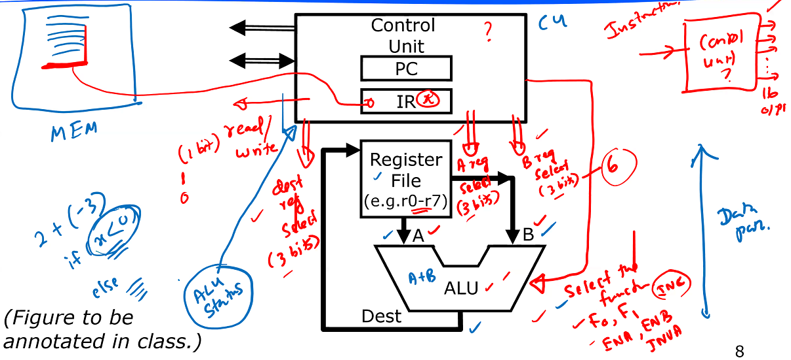

# Lecture 10

## Fetch-Decode-Execute Cycle

1. (Fetch) Fetch next instruction from memory into IR
2. (Fetch) Change PC to point to next instruction
3. (Decode) Get type of instruction just fetched (look at opcode)
4. (Execute) Issue control signals etc.
5. Return to step 1.

Here is data path:

## Control Unit and Control Signals

Need to know:

- how to tell ALU what to do?
- which register values to send to A and B buses?
- which register to put output?
- how to know when to read or write to memory?

We will need signals like:

- F0, F1, ENA, ENB, INVA, INC for ALU (width 6)
- select A register and B register (for 8 = $2^3$ registers, need at least 3 bits for selection)
- select destination register (3 bits for 8 registers)
- read/write (1 bit). 

Here, we have **16 outputs** for the control unit. The **input** is the instruction, which is stored in IR.

 

Not discussing how to design a control unit - it's actually a state machine.

### Data influencing Control

Sometimes, ALU needs to know more than just instruction - needs to know information about data to make conditional execution possible. This is the job of the **Status Register** - determined by ALU operations, and stores the status of last ALU operation. Status register is another special-purpose register.

Status flags:

- **Z: zero flag** - was the last result 0?
- **V: overflow flag** - assuming two's complement, did last addition/subtraction overflow?
- **C: carry flag** - was carry-out generated?
- **N: negative flag** - basically just the MSB (sign bit in 2's complement).

#### Example

For operation $8_{10} - 9_{10}$, what values are in status register?

8 in 2's complement is `01000`, -9 in 2's complement is `10111`.

(shortcut method to find 2's complement) Instead of inverting all bits then adding 1, start from LSB (right) and keep moving left until you hit the first 1. Once you hit the first 1, invert all bits to the left including the first 1.

So, `01000 + 10111 = 11111`, carry-in to MSB is 0, carry-out to MSB is 0. This means not zero, no overflow, no-carry-out, negative.

## C Programming

ye