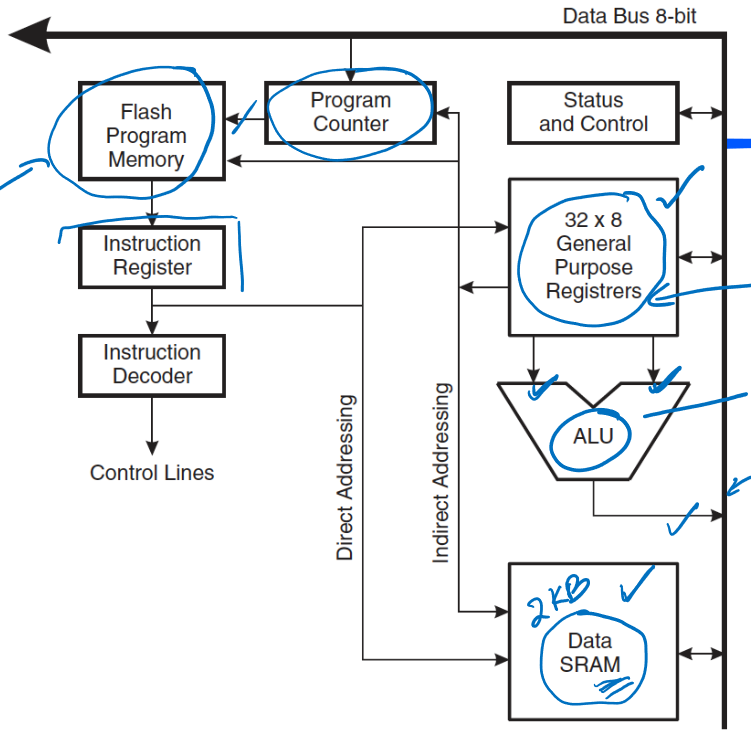

# Lecture 11

## Machine Code and Instructions

Machine code is just 1s and 0s - the bits just specify the instruction to be executed.

Instructions consist of an *opcode* which defines the operation, and *operands* which specify what is to be operated on (e.g. registers or a memory address)

Here is an example of a PowerPC instruction:

Here, the first 6 bits specifies the opcode - in this case, opcode 14 means this is integer addition. Destination register indicates $5_{10}$ and source is $12_{10}$ so we add number in r10 to r5.

### Instruction Set Architecture

ISA is a document which specifies how the instructions are formatted (interaction between hardware and software). More on this in later lectures.

##### Microarchitecture

Microarchitecture is arrangement of logic gates, flip flops, etc. for the actual control unit. 

One ISA can be implemented by different microarchitectures, since an ISA is just a specification.

## Assembly Language

Assembly language is human-readable machine code, which is converted into machine code by an *assembler*.

### Atmel AVR

An Atmel AVR is a microcontroller - contains CPU, RAM, memory and io devices. The family is 8bit, so 8-bit alu and registers. Specifically looking at Atmel AVR, examples of instructions are like `add r3, r4` means `r3 <- r3 + r4`, etc.

Here, general purpose registers are r0 - r31. SRAM is data memory specifically for variables, and flash program memory stores actual instructions. Here, everything is 8 bit.

Here is rest of ATMEGA324A microcontroller. Port A-D are general-purpose io ports (GPIO). Left is clock circuit. T/C stands for timer/counter - just like a normal counting circuit. SPI is communication interface, which uses USART and TWI (all comms interfaces, connects with other devices). A/D converter converts some analog signal into 1s and 0s, e.g. with some sensor or audio signal.

### AVR Instructions

Most instructions are 16 bits wide, first 6 is usually opcode

| syntax           | instruction                                                  | description                                                  |
| ---------------- | ------------------------------------------------------------ | ------------------------------------------------------------ |
| `MOV rd, rr`     | `0000 11rd dddd rrrr`                                        | copy contents of register rr to register rd.                 |
| `COM rd`         | `1001 010d dddd 0000`                                        | flip all bits in register                                    |
| `LDI rd, number` | `1110 KKKK dddd KKKK` where `K` is constant, `d` register number | load immediate; put the number in the given register. for r16-r31 only. can specify number in different base, e.g. `255, -1, 0xFF, 0337, 0b11111111`. |

`ADD rd, rr`, `AND rd, rr`, `OR rd, rr`, `EOR rd, rr` - just like ALU operations, results go into `rd`.

### AVR Status Register

| Position | Name | Description                                                  |
| -------- | ---- | ------------------------------------------------------------ |
| 0        | C    | carry                                                        |
| 1        | Z    | is zero                                                      |
| 2        | N    | is negative                                                  |
| 3        | V    | overflow                                                     |
| 4        | S    | actual sign of outputted value corrected for overflow, $S = N \oplus V$ |
| 5        | H    | half-carry bit: if there is carry out from first 4           |
| 6        | T    | test bit                                                     |
| 7        | I    | interrupt                                                    |

