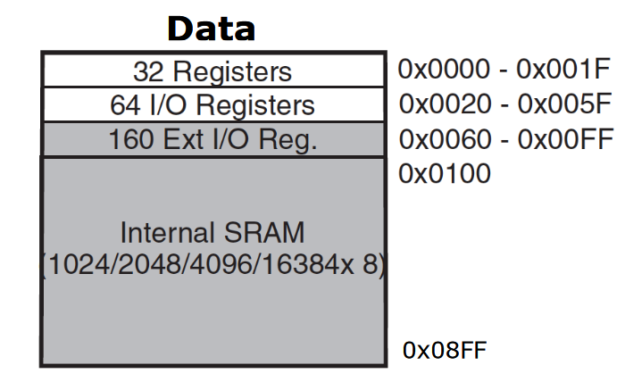

# Lecture 12

Instruction set architecture is just a specification of the interface between hardware and software. Microarchitecture is how the control unit is built. Microarchitecture designers don't need to know about the software which will be running; only need to build a microarchitecture which implements ISA. Programmers don't need to know much about microarchitecture; only need to generate instructions which conform to ISA.

## Memory Models

Memory model is how the memory looks like to the CPU.

### Addressable Cell Size

Memory has cells each with its own address, commonly 8 bits wide (but AVR has 16 bits). Buses transport content of cells, and sometimes may be wider than the cells to retrieve several addresses at once.

For example, if you had $2^n$ cells, each cell 8 bits wide, then if your data bus is also 8 bits then you need $n$ address bits. But now if you increase data bus to 16 bits, then each address refers to 2 cells, so now you only need $n-1$ address bits. So, for every *doubling* of data bus width, you can remove the LSB of the address bus (because you can transfer more at once).

### Alignment

A lot of architectures require that n-byte words have addresses starting at multiples of n. This is called natural alignment. You could have an 8-byte word starting at address 12, but that's not as efficient as storing it at address 0, 8 or 16 for example.

An example of a CPU which doesn't require alignment is Pentium IV, with 64-bit data bus (8 bytes at a time). For it to read a 4-byte word at address 6 for example, it would need to do a 16-byte read from address 0 - 15, then extract the required 4 (since you would need 6-7-8-9 which doesn't fit within one read).

Note that the above is only possible in CPUs which don't require alignment.

### Address Spaces

The von Neumann Architecture is where the processor only has *one* linear address space, e.g. $2^{32}$ cells from 0 to $2^{32} - 1$. However, the Harvard Architecture has *separate* address spaces for data and instructions.

The AVR ATmega 324A has 2048 bytes for data address, and $2^{14}$ 16-bit words for instructions (2 bytes each).

#### Data Address Space

Note that registers in memory are not the same as the D-flip flops in the CPU, also called registers. 

224 I/O registers - first 64 is I/O register, last 160 are extended I/O registers. Need different instructions to access.

#### Program Memory Address Space

Also called flash memory. 16 bits wide, has application flash section and boot flash section (smaller).

### Endianness

Little endian - LSB stored at smaller address in the word (Intel microprocessors)
Big endian - MSB stored at smaller address in the word.

This is to do with the ordering of bytes, not bits.

Most processors > 1992 are bi-endian - compatible with both.

## Registers

Two types:

1. general purpose - for temporary results
2. special purpose:
   - program counter
   - stack pointer
   - status register

For ATmega 324A, 32 general purpose registers. Some instructions only work with upper half.

X, Y, Z registers are r26 - r27, r28 - r29 etc. These are 16-bit registers formed from 2 8-bit registers. Little endian.

I/O registers for

- timers, counters
- analog to digital converters
- serial I/O
- general purpose I/O ports
- 3 registers associated with each (X in A, B, C, D)
  - DDRx - data direction register
  - PORTx - values to output
  - PINx - values on pins.

## Instructions

This is main feature of ISA. Types include

- I/O
- load/store (data <-> memory)
- move
- arithmetic
- logical
- branching (conditionals)

For I/O, memory addresses 32 to 255. First 64 can be accessed using `in`/`out`, other 160 can only be accessed with load/store.

See Instructions.md for `in`/`out`.

