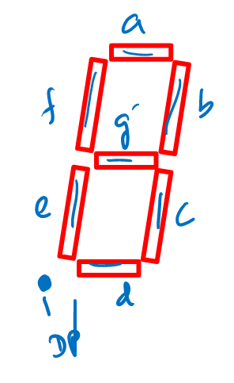

# Lecture 14

## C Stuff

### Bit Shifts

Apparently char is signed?? idk

`<<` always does `LSL` (because there is no `ASL`)

`>>` does `LSR` if unsigned and `ASR` if signed

### Pointers

yea basically ptr is just a number that stores a memory address, `&` is address of, unary `*` is indirection

array names can be treated as pointer to first element, `&(array[0])` equivalent to `array`

pointer arithmetic automatically accounts for size of data type.

### Preprocessor

glorified copy paste

headers are used for common macros, function prototypes. need to always `#include <avr/io.h>`. angle brackets around include indicate system header, quotes indicate your header.

### Macros

very dangerous glorified copy paste

## 7 Segment Display

Basically, you've got something like this. The usual layout is

| DP   | G    | F    | E    | D    | C    | B    | A    |
| ---- | ---- | ---- | ---- | ---- | ---- | ---- | ---- |

with MSB on left. Just write this to some output and then connect with wires. You can encode some light pattern by using `0b00111111` for example.