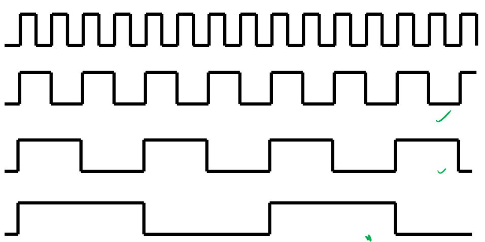

# Lecture 15

## Control Flow

Control flow linear unless program contains jumps, branches, procedures, interrupts, loops, etc. Linear means program counter/instruction pointer (PC) gets incremented after every instruction.

### `BRXX` Instructions

Using `CP`, we can use the `BRXX` instructions. Recall V is 2'c overflow and N is whether sign bit is 1 (negative). S is sign-bit corrected for overflow, $S = N \oplus V$.

| Signed? | >=                 | <            |
| ------- | ------------------ | ------------ |
| Yes     | BRGE               | BRLT         |
| No      | BRSH (same/higher) | BRLO (lower) |

Branch if equal to:

| eq?  | C    | N    | V    | S    | Z    |
| ---- | ---- | ---- | ---- | ---- | ---- |
| 0    | BRSH | BRPL | BRVC | BRGE | BRNE |
| 1    | BRLO | BRMI | BRVS | BRLT | BREQ |

Equivalent of

```c
if (condition) {
    body
} else {
    other
}
```

is

```assembly
cp __ __
brXX iflabel
; else clause here
(other)
jmp exit
if:
	; if clause here
	(body)
exit:
; carry on
```

### Different Types of Jumps

| Type     | Keyword                    | Bit size of instruction | Cycles |
| -------- | -------------------------- | ----------------------- | ------ |
| Absolute | `JMP label`                | 32                      | 3      |
| Relative | `RJMP label`               | 16                      | 2      |
| Indirect | `IJMP` (uses `Z` register) | 16                      | 2      |

## Procedures

a.k.a. subroutine, function. Similar to jumps,

| Type     | Keyword                     | Cycles |
| -------- | --------------------------- | ------ |
| Absolute | `CALL label`                | 4      |
| Relative | `RCALL label`               | 3      |
| Indirect | `ICALL` (uses `Z` register) | 3      |

How does procedure know where to return to, how to specify operands? We could use some fixed memory address used by all procedure calls, but then procedures can't call other procedures and recursion is not supported. 

### Stack

We use a stack, last-in first-out data structure, which has 2 operations: push (store to stack) and pop (return from stack). Our stack lives in RAM.

In AVR there is a special register called a stack pointer (SP) which keeps track of the top of the stack. This has 2 I/O registers for 16-bit stack pointer (SPH:SPL, stack pointer high/low).

Our stack contains the *memory address of the caller*, so when our function returns, the PC will be set to the address pointed to by SP, then SP moves down.

### Stack Initialisation

Need to initialise before using it for assembly.

```assembly
.def temp=r16
ldi temp, low(RAMEND)
out SPL, temp
ldi temp, high(RAMEND)
out SPH, temp
```

## Timers and Counters

Basically, 324A has 3 timer/counters: 2 8-bit and 1 16-bit. You use a prescaler to make each pulse in the system clock input last longer.



There is a control register (an I/O register) which selects which frequency to output. More in the lab.