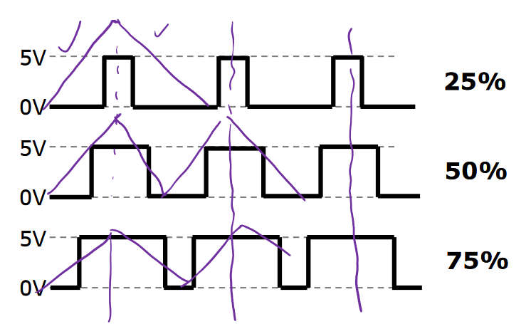

# Lecture 16

## Pulse Width Modulation

Pulse width modulation (PWM) is what it says on the tin - it varies the width of the pulses in a digital signal. The duty cycle of a digital signal is the % of time where that signal is high.
$$
\text{Duty Cycle} = \frac{T_{on}}{T_{on} + T_{off}}.
$$
If the frequency of the pulse is fast enough, the pulsed signal appears to be the (analog) average value. This means we can control the average voltage delivered to a load via PWM (for motors, LEDs, etc).

The pulse width can be varied so the average value changes over time.

Specifically for atmega, 2 modes for pwm: fast pwm and phase correct pwm.

### Fast PWM

2 options for fast PWM.

1. WGM 1011? or 0011? not sure. Both OCRnA/OCRnB are used to set the duty cycle of the pwm wave - two PWMs used for 1 timer.
   $f_{pwm} = \frac{\mathrm{CLK}}{\mathrm{PRE} \cdot 256}$
2. WGM 1111? or 0111? pretty sure 1111. this mode only has 1 PWM signal, but you can change both period (or freq) and duty cycle.
   $f_{pwm} = \frac{\mathrm{CLK}}{\mathrm{PRE} (1 + \mathrm{OCRnA})}$

### Phase Correct PWM

Centres of pulses remain at same point in time. Better for motor speed control, but won't use in course.

