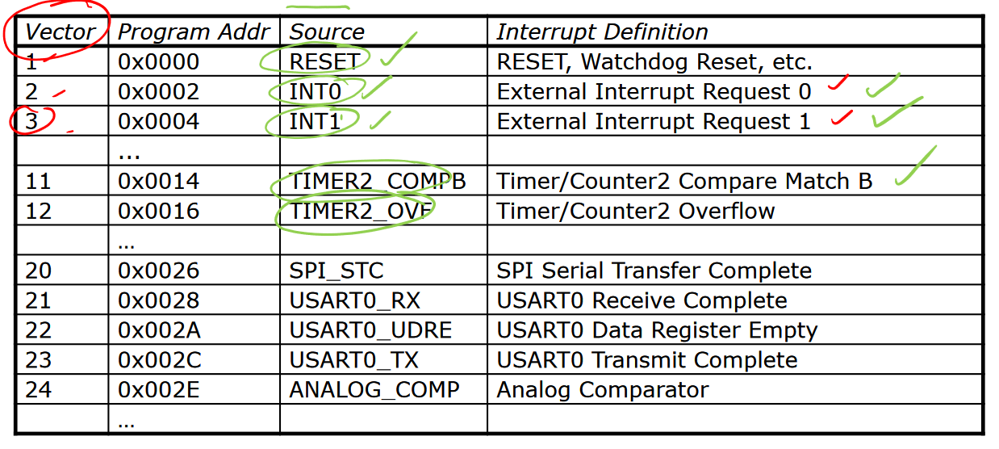

# Lecture 17

## Stack

`push rr` places value in `rr` on top of stack, decrements stack pointer (because adding to stack moves closer to low address). `pop rd` reverse.

for instructions like `call`, `rcall`, `icall`, stack pointer gets changed by 2 (because 16-bit address).

CPU needs to handle asynchronous I/O, and is faster than I/O. Needs to know when data is available from input, and when outputs can accept data. 2 options: pollling and interrupts.

## Polling

CPU periodically asks devices and waits for response. This is inefficient because wasting time, but is ok if CPU has nothing else to do...

## Interrupts

Device tells CPU when ready. Interrupts can be regular/irregular, so more efficient. 

When CPU receives interrupt, it stops what it's doing and executes something called an *interrupt handler* or *interrupt service routine* (ISR). When handler completes, control returned where it left off through special `reti` instruction (not just `ret`). No call instruction; invoked by interrupt.

We need to find the appropriate ISR to execute. First, to store return location, push PC onto stack. Then, based on interrupt source, look in an *interrupt vector table* (located at beginning of program memory), which contains table of addresses or jump instructions. (avr uses jump instructions). Then, just jump to the address in table.

Here are some examples of vectors (index in vector table), resulting address etc.



If an ISR uses registers, need to save copies of previous values and restore after `reti`. AVR doesn't automatically save status register, so need to do it manually.

### Summary

(in hardware)

1. Confirm interrupt happened
2. CPU determines source of interrupt
3. Push PC onto stack
4. Determine address of ISR from vector table
5. Set PC to ISR address
6. Disable interrupts

(in software)

7. Push values of registers to be used on stack
8. Determine source of interrupt (maybe?)
9. Execute ISR code
10. Restore registers by popping
11. `reti`

(back to hardware)

12. Re-enable interrupts
13. Pop original PC from stack and set to PC
14. Execution of original code continues

Take a look at instruction set reference to see what instructions alter status register. Sometimes, pushing SREG not necessary.

### Writing ISR in Assembly

Template ISR in assembly:

```assembly
isr_label:
	push r0
	in r0, SREG
	push r0
	
	; do some operation (usually I/O)
	
	pop r0
	out SREG, r0
	pop r0
	reti
```

### Writing ISR in C

Need to `#include <avr/interrupt.h>`. The handler can be written as C function with special `ISR` macro:

```c
ISR(INT0_vect) {
    // code here
}
```

where `ISR()` is a macro expanding to function prototype, `INT0_vect` is macro representing `INT0` external interrupt (for example). Vector table setup and register push/pop happen automatically. Use source name from datasheet followed by `_vect` as argument macro name.

Declare variable as `volatile` when variable can change outside of normal program flow (e.g. in ISR) to stop compiler from optimising.

### Setting up Interrupts

Besides handler, need to

- Set up conditions for interrupt
- Turn on interrupts globally. There is `I` bit in status register which controls global interrupts. Use `sei()` macro in C or `sei` instruction.
- Also apparently there's an I/O register with bits that you need to enable for each individual interrupt but idk

### Nested Interrupts

Most CPUs other than AVR support nested interrupts. If CPU receives interrupt while it's handling an interrupt, it will handle the new one depending on its priority instead of disabling all other interrupts. The lower the vector (index in vector table), the higher priority.

The next slide in the lectures directly contradicts this information. What?

## Traps

Basically software interrupts for exceptional events e.g. overflow, div by 0 etc. Traps save continually checking for errors, but trap handlers don't always return to original program. AVR doesn't provide traps but can emulate this behaviour by writing a value to a pin and feeding that output pin to an input pin, letting hardware interrupts do the work. This is mmh.