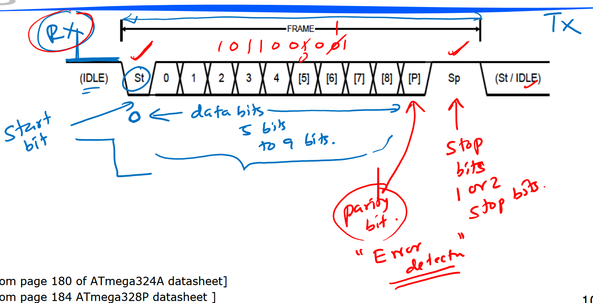
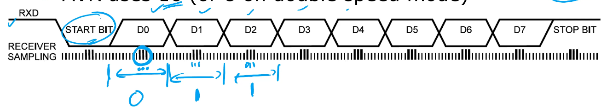

# Lecture 18

## Serial IO

Communications can be either serial or parallel. Transmitter: TX, receiver: RX. 2 types for serial:

1. Synchronous: send clk along with data to synchronise both tx and rx to same clock, e.g. SPI (serial peripheral interface)
2. Asynchronous: only send data. Need to recover clk from data stream.

### AVR USART

UART: universal asynchronous receiver and transmitter. USART includes synchronous. ATmega324A has 2 USARTs. Since data can go in both directions, we can call it full-duplex.

- Serial communication (1 bit at a time, we communicate *frames*)
- Asynchronous (RX and TX can have different clk, and clk not transmitted)

### UART Frames

The diagram above shows 1 frame sent from TX to RX.

1. The line is initially at logic 1.
2. Start with the *start bit* at the beginning of the frame, usually a 0.
3. AVR supports 5 to 9 bits of *data bits* which comes after the start bit.
4. Then, we need a *parity bit* after the data for error detection.
5. At the end, we use either 1 or 2 bits as *stop bits*.
6. Then back to logic 1 for idle or another start bit for the next frame.

Parity bit is there to mitigate bit errors from EM interference. We either use even parity or odd parity as standard, but TX and RX need to use the same standard.

- Even parity: number of 1s in data + parity bits must be even
- Odd parity: number of 1s in data + parity bits must be odd

We change the parity bit to make the total number of 1s be even or odd according to the standard. If any bit gets flipped, we are able to detect if 1 bit has been flipped, but can't detect other errors (e.g. 2 bits being flipped).

### How to Recover Data

Baud rate: symbols per second. Not bit-rate: bit-rate only deals with the data bits, whereas baud rate also includes the start/stop, parity, etc. 9600 baud is a common baud rate. 

The receiver must know the *baud rate*, but the clock signals don't need to be synchronised. 

The receiver samples 16 times within the baud rate for each bit, takes the middle 3 samples, and interprets the value for that bit as the majority value in those 3 samples.

### Configuring AVR

Need to set the baud rate register (16-bit). We have 16 samples per symbol, so use the following formula:
$$
\mathrm{UBRRn} = \frac{f_{osc}}{16 \mathrm{BAUD}} - 1
$$
where $f_{osc}$ is system clock oscillation frequency (8MHz) and $\mathrm{BAUD}$ is baud rate (e.g. 9600). We usually use the 'asynchronous normal mode' of USART.

Then, write the data you want to TX into the TX buffer. We receive data in the RX buffer. We then have 3 control and status registers: `UCSRA`, `UCSRB`, `UCSRC`.

Can either use polling to check whether TX/RX buffers available, or use an ISR. See lab 15.

### Serial Communication on PC

I/O board has a USB-serial device. Use terminal program such as putty to receive. Need to specify COM port, baud rate, start/stop/parity, etc.

RS232 is a serial communication standard - used in older computers but common.

## Analog to Digital Conversion

ADC is where we convert some voltage between 0 and some maximum $V_{ref}$ to a digital value. We have some resolution - for AVR we have 10-bit resolution (range 0 - 1023).

Can use port A pins on 324A as analog inputs. Convert 1 input at a time with analog multiplexer. See future lab.

