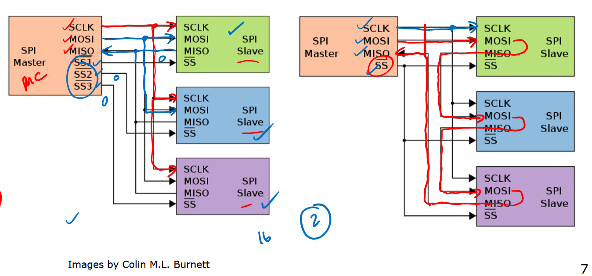

# Lecture 19

## More I/O

A master initiates and controls the transfer of data. A slave waits for requests, receives the data and responds to master. One master can have many slaves, but one slave can only have 1 master at a time. e.g. CPU slaves disk drive (reading from disk), disk drive slaves memory (because writing to RAM). Memory can never be a bus master as it only supplies information.

### I2C

Inter-integrated circuit - used for serial communication.

### TWI

Two-wire interface; supported by ATmega which has one TWI port. Use pins C0 (SCL) and C1 (SDA). Datasheet pages 211-239 have more details and description of TWI.

### SPI

Serial-parallel interface: used for LED matrix.

- MOSI: master out slave in. Basically TX for the master.
- MISO: master in slave out. RX for the master.
- SCK: clock signal sent to all slaves.
- SS: slave select. Because one master can be connected to multiple slaves, this selects which slave the data goes to / comes from.



2 main options in terms of connections between master and slave: can have 1 slave select for each slave but this is costly in terms of pins. Alternatively, route MOSI/MISO through all slaves and use an addressing scheme to tell the slaves which one needs to receive the data.

#### SPI for AVR

ATmega324A has 1 SPI port using pins B4-B7. Hardware takes care of generating signals, and AVR can be master or slave. UART can also be used as a master. Relevant information is in p166-174.

### Bit-Bashing

We can simulate I/O standards using GPIO ports and serialise/deserialise through software. This is called bit-bashing, and is usually done when a microcontroller doesn't have hardware support for a particular standard.

## AVR C Programming Tips

Remember to declare variables which may change outside normal flow of control (e.g. interrupt handler) as `volatile`; compilers will not optimise code involving this variable if you use the keyword.

When setting bits in a register it's best practice to use the actual names for registers (defined in `<avr/io.h>`) and use left-shift compared to writing the hex or decimal value. e.g.

```c
TCCR1B = (1 << WGM12) | (1 << CS11);
```

You can do the same in assembly.

Basic bitmask operations:

- To set a bit: `x |= (1 << bit);`
- To clear a bit: `x &= ~(1 << bit);`
- To toggle a bit: `x ^= (1 << bit);`

