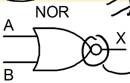

# Lecture 2

## Logic Gates

gates are multiple-input, 1 output. part of the `digital logic` level of abstraction

7 basic types:

| basic | + not |
| ----- | ----- |
| NOT   |       |
| AND   | NAND  |
| OR    | NOR   |
| XOR   | XNOR  |

inputs/outputs can only be in 2 states: logic '0' (0V), logic '1' (0.8V - 5V)

for each gate, there is

* logic symbol
* truth table
* boolean expression
* timing diagram

in general, if there are $N$ inputs, there will be $2^N$ rows in truth table.

### NOT

inverts the input. bubble in logic symbols means inversion.

| A    | X    |
| ---- | ---- |
| 0    | 1    |
| 1    | 0    |

### AND

output is HIGH when **all** inputs are HIGH.

| A    | B    | X    |
| ---- | ---- | ---- |
| 0    | 0    | 0    |
| 0    | 1    | 0    |
| 1    | 0    | 0    |
| 1    | 1    | 1    |

### OR

output is HIGH when **at least** one input is HIGH.

| A    | B    | X    |
| ---- | ---- | ---- |
| 0    | 0    | 0    |
| 0    | 1    | 1    |
| 1    | 0    | 1    |
| 1    | 1    | 1    |

### NAND

output is HIGH when **at least** 1 input is LOW

| A    | B    | X    |
| ---- | ---- | ---- |
| 0    | 0    | 1    |
| 0    | 1    | 1    |
| 1    | 0    | 1    |
| 1    | 1    | 0    |

### NOR

output HIGH when all inputs are LOW

| A    | B    | X    |
| ---- | ---- | ---- |
| 0    | 0    | 1    |
| 0    | 1    | 0    |
| 1    | 0    | 0    |
| 1    | 1    | 0    |

### XOR

output HIGH when **exactly one** input is HIGH

| A    | B    | X    |
| ---- | ---- | ---- |
| 0    | 0    | 0    |
| 0    | 1    | 1    |
| 1    | 0    | 1    |
| 1    | 1    | 0    |

### XNOR

output HIGH when inputs are **the same**

| A    | B    | X    |
| ---- | ---- | ---- |
| 0    | 0    | 1    |
| 0    | 1    | 0    |
| 1    | 0    | 0    |
| 1    | 1    | 1    |

### XOR vs XNOR

xor: odd function, HIGH when odd number of inputs set to high

xnor: even function, HIGH when even number of inputs set to high

## Boolean Logic Functions

can use boolean algebra

### Notation

`NOT(A)` = $\bar{A}$

`AND(A, B)` = $AB$ = $A\cdot B$

`OR(A, B)` = $A + B$

`XOR(A, B)` = $A \oplus B$ = $\bar A B + A \bar B$

`NAND(A, B, C)` = $\overline{ABC}$

## Logic Diagram

### Conventions

## Logic Function Implementation, Boolean Simplification

Any logic function can be implemented as OR or AND combinations of inputs, called *sum of products*

### truth table example

example: given this truth table

| A    | B    | C    | M    |
| ---- | ---- | ---- | ---- |
| 0    | 0    | 0    | 0    |
| 0    | 0    | 1    | 0    |
| 0    | 1    | 0    | 0    |
| 0    | 1    | 1    | 1    |
| 1    | 0    | 0    | 0    |
| 1    | 0    | 1    | 1    |
| 1    | 1    | 0    | 1    |
| 1    | 1    | 1    | 1    |

process:

1. for each `1` in output column, write down the AND combination of inputs that give that 1.
2. OR them together.

for the example, we need to consider
(0, 1, 1), (1, 0, 1), (1, 1, 0), (1, 1, 1).

so we do

$\bar ABC + A \bar B C + A B \bar C + ABC$.

literally encoding the output with the OR.

each of the ORed terms are called *product terms* or *min terms*.

draw using vertical bars for variables and inverted versions, then connect them

### Boolean Identities

In AND and OR, operations are

- commutative
- associative
- idempotent ($AA = A$, $A + A = A$)

AND identity is 1, OR identity is 0
$0A = 0$, $1+ A = 1$

distributive law:

* $A + BC = (A + B)(A + C)$
* $A(B + C) = AB + AC$

absorption law:

* $A(A + B) = A$
* $A + AB = A$

**De Morgan's Law**:

* $\overline{AB} = \bar A + \bar B$
* $\overline{A + B} = \bar A \bar B$
* "break the line, change the sign"

#### Example

Express $Z = \overline{A(B + C(\bar A + \bar B))}$ as sum of products

we have
$$
\begin{align*}
&\overline{A(B + C(\bar A + \bar B))}  \\
&= \bar A + \overline{B + C(\bar A + \bar B)}  \\
&= \bar A + \bar{B} \cdot \overline{C(\bar A + \bar B)}  \\
&= \bar A + \bar B \cdot (\bar C + \overline{\bar A + \bar B})  \\
&= \bar A + \bar B \cdot (\bar C + A \cdot B)  \\
&= \bar A + \bar B \bar C + A B \bar B  \\
&= \bar A + \bar B \bar C + A \cdot 0  \\
&= \bar A + \bar B \bar C.
\end{align*}
$$
