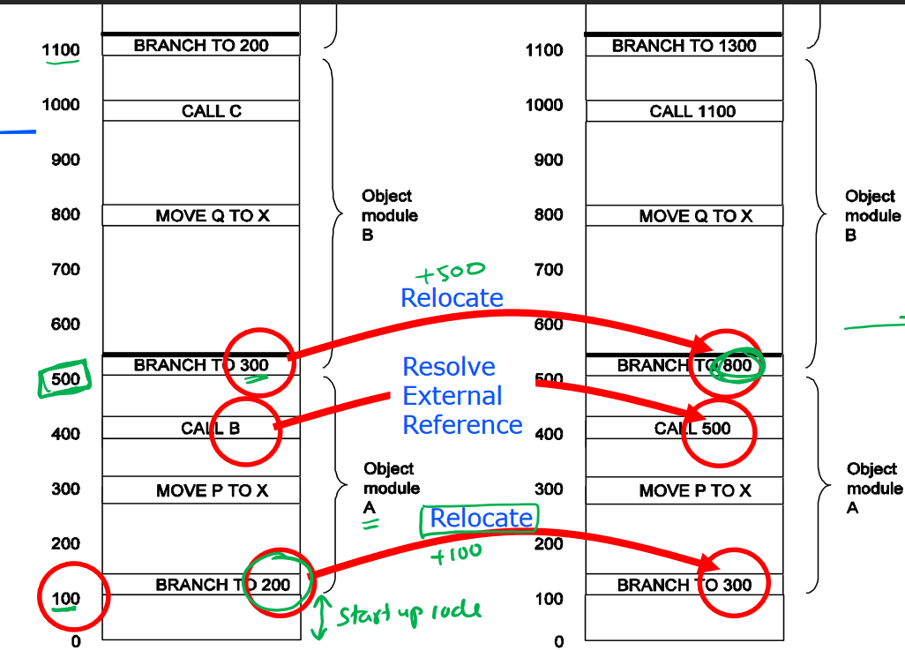

# Lecture 21

## Compilation and Linking

### How does code run?

In compiled languages, programs must be converted to machine code to run. This is called compilation and often uses assembly language as intermediate step. 

In interpreted languages, the programs you write are inputs to an interpreter which runs on the processor. This is typically slower as the interpreter needs to figure out what your program does in run-time, rather than having pre-compiled code.

Java is in the middle - Java source gets compiled to bytecode (kind of half-compiled) which is then run on the Java Virtual Machine (an interpreter).

For C, we need to know:

1. How to map variables to memory
2. How to translate C code to assembly instructions
3. How to go from assembly instructions to machine code (Lecture 20).

### How do variables in C map to memory?

Declaration reserves space in memory, and initialisation populates the space with values.

The following example with global variables:

```c
// Initialisation of global variables
int count;
char c;
static int a;
```

turns into:

```assembly
.dseg
count: .byte 2
c: .byte 1
a: .byte 2
```

Additionally, variables are default-initialised to 0, so compiler will put some `st` or `sts` code after. For *global* variables and functions, `static` means that it is only visible within the file.

For local variables:

```c
void function(void) {
	int8_t a;
	uint16_t b;
	static int c;
	// ...
}
```

Local non-static variables have their values stored on the current stack frame. Local static variables are stored in the same location as global variables are (low end of memory), but are only accessible within the function.

## Object Files

Compiling C has the similar forward-reference problem from assembly. The compiler often generates all necessary object files (`.o`) first as an intermediate step, and then work out final details such as memory locations in the linking process at the end.

Object files are created for each individual module so only changed files need their object files recompiled. To do this, we need relocatable object modules. (object file = object module)

There are many different object file formats, but we will focus on `ELF` format:

1. Identification section
   - name of module
   - location of other sections in file
   - assembly date
2. Entry point table
   - list of symbols and their values, defined in module that other modules may reference. addresses are relative to *beginning of this object module*.
     - procedure entry points
     - variables
3. External reference table
   - list of symbols which are used in module but defined elsewhere
   - list of instructions which use these symbols
4. Machine instructions and constants
   - assembled code and constants (`cseg`, `dseg`). these addresses are incorrect and need relocation
5. Relocation dictionary
   - list of addresses of code/data in section 4 which need to be relocated. a **relocation constant** will be added to instructions/data at those addresses; separate constants are used for instructions and data.
6. End of module
   - checksum to catch errors (not all the time)
   - address to start execution

## Linker

### Libraries

Libraries are a collection of object files with an additional index, which provide useful functions e.g. C standard library (standard I/O, string handling, date/time functions, general utilities).

Note that this is different to the *header* file which **declares** function prototypes, preprocessor macros and `extern` variables. The library refers to the object files, and the header documents an "interface" to the library.

### Linking

Same forward reference problem as assembler, so linker needs two passes of the object files. Addresses either need to be *relocated* (adding some constant value) or *resolved* (find value of external address).

Recall that when each object file is created, addresses are relative to the start of the file (so starting from 0). But when we're linking all the files together, we need to offset where everything starts based on the current location we're already at. For example, if we are at address 100 after start-up code, the first object module will be at 0 + 100 so relocation constant will be 100. Addresses for branches need the relocation constant to be added.

Similarly, when calling things from other modules, we resolve the external reference by substituting in the *new* value for the address. So, first step is to calculate relocation constants, and then change addresses, and then update references based on the new locations.



### Dynamic Linking

As opposed to linking things during compilation, we can link things during runtime. DLL on Windows is an example of this. This reduces binary size which saves space. Libraries can be updated independently of programs which use them, but this can create dependency issues.

