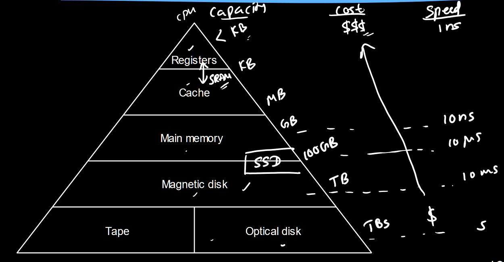

# Lecture 22

## Units of Memory

There can be confusion with SI terms like mega- and giga- where mega can either mean $10^6$ bytes or $2^{10}$ bytes i.e. 1024kB, or even 1000kB. All of these are different.

- For *main memory capacity*, always use powers of 2, e.g. 1GB = 1024 * 1024 * 1024 bytes = $2^{30}$ bytes.
- For *hard disks*, manufactures base sizes on powers of 10, e.g. 1GB = $10^9$ bytes.
  - but operating systems (e.g. Windows) use powers of 2 for disk sizes.
- For *data speeds*, usually use powers of 10, e.g. 1Gbps (gigabit per second) = $10^9$ bits per second.
- But sometimes they use both!
  - e.g. 1.44MB floppy disk could store 1.44 * 1000 * 1024 bytes!!! why?!

Standardised terms have been created for binary prefixes:

- 1 kibibyte = 1KiB = 1024 bytes ($2^{10}$)
- 1 mebibyte = 1 MiB = 1024KiB ($2^{20}$)
- 1 gibibyte = 1GiB = 1024MiB

## Types of Computer Memory

### Memory Hierarchy

Higher up, more expensive, less capacity but way faster.

### RAM

RAM: random-access memory. This originally meant that you can access any cell (compared with sequential access), but now just means volatile read/write memory.

- SRAM (static memory): flip-flops or latches used to store bits
- DRAM (dynamic memory): each cell is a transistor + capacitor.
  - Cells are smaller so can fit more bits on a chip than SRAM, but is slower than static.

### Volatile/Non-Volatile

Volatile memory is forgotten when power is switched off. Both SRAM and DRAM are volatile.

Contents of non-volatile memory are retained when power is switched off.

- ROM (read-only): programmed by memory manufacturer, where contents are hard-wired in silicon
- EPROM (erasable programmable): can be erased, e.g. with ultraviolet light
- EEPROM (electrically erasable programmable): erase by applying a certain voltage
- Flash memory is similar to EEPROM, but flash memory is written/erased in blocks, whereas EEPROM is written/erased one cell at a time.
  - ATmega324A has 2 flash blocks: application section and boot loader.

### Cache Memory

Cache memory in CPUs are faster than main memory, as performance suffers if CPU is always waiting. This memory is expensive so there is a small amount. Often multiple levels:

- L1
  - inside CPU itself
  - runs at same speed as CPU
  - 32kB - 128kB
- L2
  - usually on same chip or module as CPU
  - could be slightly slower as CPU
  - 256kB - 16MB
- L3
  - some machines have a third level
  - 2MB - 256MB

### Magnetic Disks

Magnetic disk drives contain stacks of rotating platters with magnetic coating, where read/write heads float above surfaces. Data usually stored on both sides of platter in circular tracks. Heads move in and out in radial direction which select the specific track (radial position). Annulus sectors from each track are just called sectors and are the smallest segments of data (usu. 4096 bytes). These contain:

- preamble: allows head to synchronise the data
- data
- error-correction codes
- inter-sector gap

Set of all tracks at given radial position is called a cylinder; number of tracks = 2 * number of platters (assuming both sides used). All heads move together.

Actual data occupies ~85% of total disk capacity; this is the quoted capacity. In this 85%, 95% is used for data and 5% is used by the file system (Lec 23).

#### Calculations

access time = seek time + rotational latency + transfer time

- seek time: time to move heads to right cylinder.
  - on average, this is $\frac{1}{3}$ of the edge-to-edge seek time. this is on datasheet.
- rotational latency: time to wait for sector to arrive under head.
  - on average, this is $\frac{1}{2}$ of the rotation time (period of one revolution)
- transfer time: time for sector to fully pass under head.
  - negligible compared to other two; neglect this.