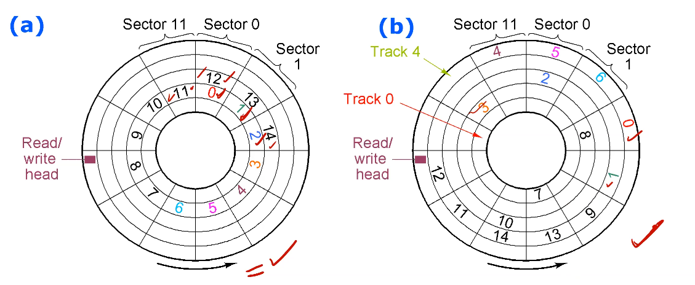

# Lecture 23

## Files

The user shouldn't need to worry about details in how data is stored. To the OS, a file is just a sequence of bytes; any structure is up to the application program. 

A *file system* associates files (just collections of sectors) with names and directories. Some sectors are used to index information (e.g. file allocation table). Other sectors store the actual files. There are many different file systems used.

You can format a disk at different levels.

- Low level format: reinitialise all sectors (preambles, empty data, ECC). No file system used.
- High level format: creates an empty file system and only writes index/table sectors.

When a file is deleted, it doesn't mean it's erased from disk; the OS may just delete the index entry and not overwrite the sectors where the file was stored.

File storage is allocated in *blocks* or *allocation units*. Blocks could be from 1 to several sectors (typically around 512B-32KB block size). The OS maintains a map from filename to set of blocks, which is file allocation table. A larger block size reduces FAT size but wastes space at EOF (avg wasted space is 1/2 block size).

Assuming 1 block = 1 sector, situation (a) below is ideal but not likely because of fragmentation (b). As blocks get more fragmented, time taken to access each is increased, so disk should be *defragmented* to improve performance.

## Buses

Bus: collection of wires connecting various things together. They are both internal and external to CPU; external ones managed by bus controller, which takes care of memory buses and I/O buses. In PC context, bus controller is called a chipset. Won't get into more detail for this course.

External I/O devices are called peripherals; one standard is PCI bus (peripheral component interconnect). There is serial version called PCIe (express), and also USB is serial too. 

There are maximum data transfer rates for these buses, but these are often unrealistic. Practical transfer rate is 1/2 of maximum.

