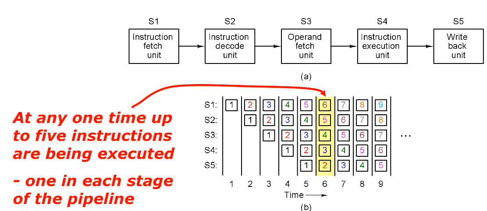

# Lecture 24

## Pipelining

Pipelining divides a task into several smaller tasks which can be completed in less time, where the smaller tasks are executed in parallel to queue up following instructions (throughput can be increased).

Modern processors use this extensively, e.g. five-stage pipeline:

Although total time doesn't decrease, the next instruction can be queued in as soon as the longest small task finishes operating.

We do this for a higher clock rate (what previous sentence was talking about) and higher throughput (may achieve 1 instruction per cycle if pipeline is full). Note that latency (time per instruction) is same or worse than a non-pipelined processor.

However, at a branch, the CPU needs to guess which instructions to continue putting in the pipe. If it guesses wrong, it has to throw away the instructions which have started processing. So, accurate *branch prediction* is important.

AVR has 2-stage pipeline: fetch and execute.