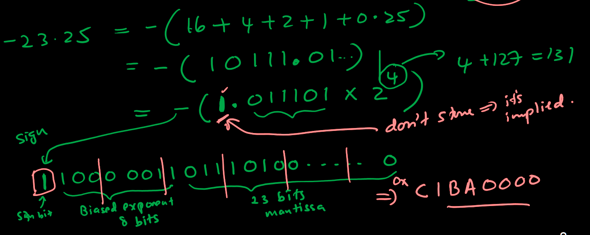
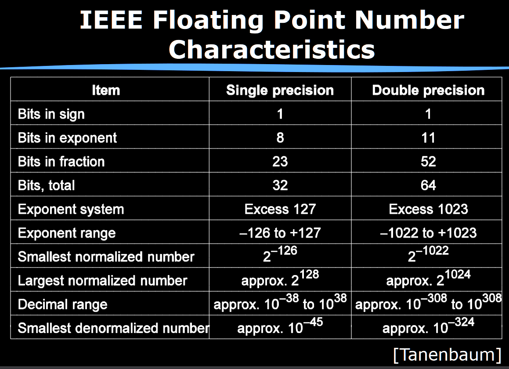
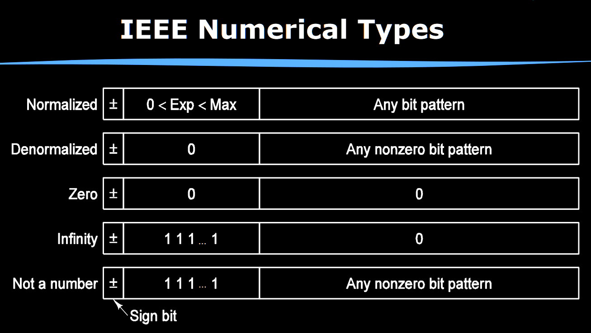

# Lecture 25

How do we represent fractional quantities?

## Fixed-Point Numbers

We could arbitrarily fix the decimal point somewhere. For example, with 4-4 unsigned fixed-point representation (4 integer bits and 4 fractional bits), the fraction 4.375 can be represented as:

| 8    | 4    | 2    | 1    | d.p. | 1/2  | 1/4  | 1/8  | 1/16 |
| ---- | ---- | ---- | ---- | ---- | ---- | ---- | ---- | ---- |
| 0    | 1    | 0    | 0    | d.p. | 0    | 1    | 1    | 0    |

or just `01000110`. However, not all numbers can be accurately represented - what to do with 7/3?

Note that for 2's complement fixed-point notation, the MSB bit of the integer part is the sign bit. Essentially, fractional part works the same but 2's complement applies to the integer part.

## Floating-Point Numbers

With scientific or floating-point notation, number = $f \times 10^e$ where $f$ is fraction (or mantissa) and $e$ is exponent. 2 IEEE standards:

- single precision (32 bits)
  1. MSB is sign bit
  2. 8 bits of biased exponent, i.e. exponent in excess-127 (actual + 127)
  3. 23 bits of mantissa
- double precision (64 bits)
  1. MSB is sign bit
  2. 11 bits of biased exponent
  3. 52 bits of mantissa

The mantissa is always normalised (begins with 1) which is not stored in the representation.

### Example

What is single-precision representation of -23.25?

### Other Information

- Zero exponent and mantissa gives 0.
- 255 exponent (maximum) and 0 mantissa gives plus/minus infinity; used for division by 0.
- 255 exponent (maximum) and non-zero mantissa gives NaN; used for 0/0. NaN propagates through subsequent operations.
- Zero exponent and non-zero mantissa gives a *denormalised* number; take exponent to be -126, and there isn't a implied leading 1 in mantissa anymore. This allows for numbers smaller than $2^{-126}$.

