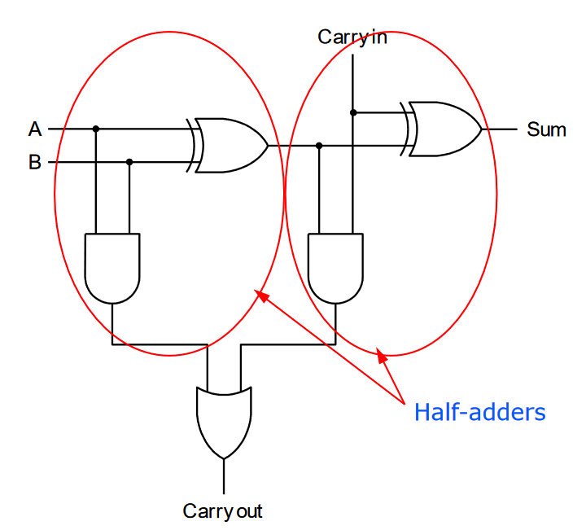

# Lecture 3

## Equivalent Circuits

All circuits can be constructed from NAND and NOR gates - they are called complete gates. One motivation for this is that it is easier to build NAND and NOR gates from transistors.


## Binary Arithmetic

### Addition

Keep track if you have a carry out going to the next column. Just like normal decimal addition, however:

- two's complement doesn't require you to do anything with *carry-out from MSB* to get correct result
- for one's complement, have to add *carry out* ***from MSB*** to **result** to get correct answer.

This is another advantage of using 2's complement over 1's complement.

#### Overflow for Addition

Overflow happens when there's not enough bits to represent the answer. For example, for 8-bit unsigned:

```
  1111111
  --------
  00001111
 +11110011
 ---------
  00000010
```

#### Detecting Overflow

**Unsigned**: carry-out from the MSB == 1
**2's comp**: carry-in to MSB and carry-out from MSB are different, or 2 values added of same sign give result of opposite sign.

#### Half Adder

Half adder is a circuit taking in 2 inputs, and outputs 2 values: sum and carry-out.
Sum is 1s place, carry-out is 2s place.

Truth table:

| A    | B    | C    | S    |
| ---- | ---- | ---- | ---- |
| 0    | 0    | 0    | 0    |
| 0    | 1    | 0    | 1    |
| 1    | 0    | 0    | 1    |
| 1    | 1    | 1    | 0    |

Logic equation:
$$
S = \bar A B + A \bar B = A \oplus B \\
C = AB
$$

#### Full Adder

But we also have to deal with the carry-in from the previous adder. Full adder takes this into account, so we have



it's like adding A and B, then adding carry in to that output.