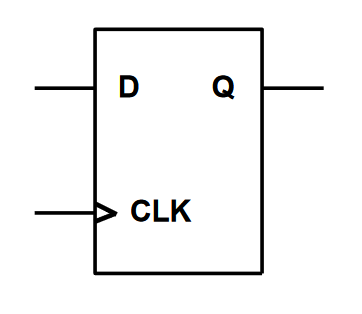
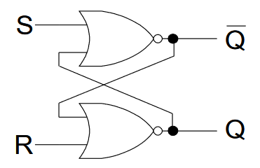
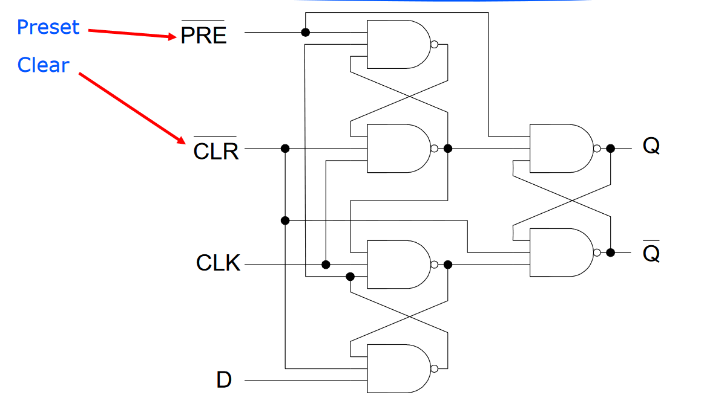

# Lecture 5

## Sequential Circuits

unlike combinational circuits, current output depends on current inputs and past history of inputs. circuits with memory can remember values even when input changes

## D flip flop

D is input, CLK is clock signal, Q is output. Arrow next to CLK represents rising edge - circuit will "update" when the clock signal goes from low to high. Similarly, if there is bubble outside of CLK input, this means falling edge - updates when high to low.

### Characteristic Table

characteristic table defines operation of circuit in tablular form instead of timing diagram:

| D    | Q(t+1)    |
| ---- | --------- |
| 0    | 0 (reset) |
| 1    | 1 (set)   |

Q(t+1) column corresponds to what output will be on next clock edge

### Register

since one d-flip-flop remembers 1 bit, to remember n bits you need n d flip flops.

So, an n-bit register can be made using n d flip flops.

There are other types of flip flops (JK and T) but will not be covered here.

## Latches

SR latch: set/reset latch.

Outputs feed back into other gate - cross-coupled.

See lab5 for details on latches.

Latches are level-triggered - output changes on changes of logic levels on inputs

Flip flops are modified latches which are sensitive to an edge - either rising, falling

D flip flop schematic using latches:

## Synchronous vs Asynchronous

for synchronous sequential circuits, flip flops only change at discrete instants of time, controlled by one global clock signal.

for async, there can be different control signals, this won't be covered in course.