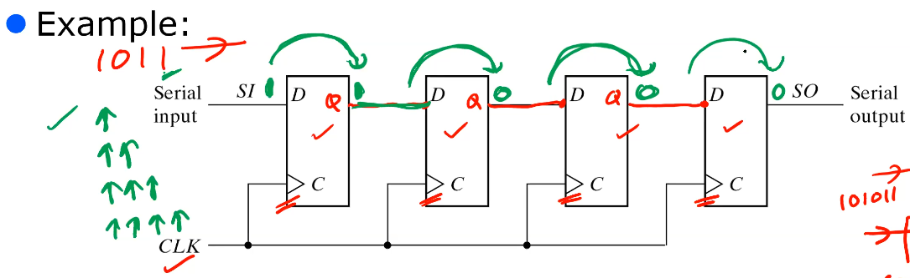

# Lecture 6

## Shift Register

register which can shift binary info in one or both directions. this is useful because multiplication/division can be done by bit shifts.

### serial in serial out

Send in bits into the input, update the clock every time you send a new bit.
When a bit goes in and clock edge triggered, then all bits move one to the right. due to propagation delays, circuit doesn't break; the previous input doesn't automatically get transferred all the way to the right.

### serial to parallel conversion

simply attach parallel outputs to each output of D flip flop.

### why not both?

this either does parallel in, serial out, or serial in, parallel out, and changes using select signal w/ multiplexers.

### bidirectional shfit register

right shift is normal. left shift requires you to send the serial bits from the right to left, then the output is connected to the previous input. same multiplexer switch.

### all of the above

this is universal shift register - uses 4-1 mux, can select parallel->serial, left/right shift, or no change. combine previous wiring configurations.

