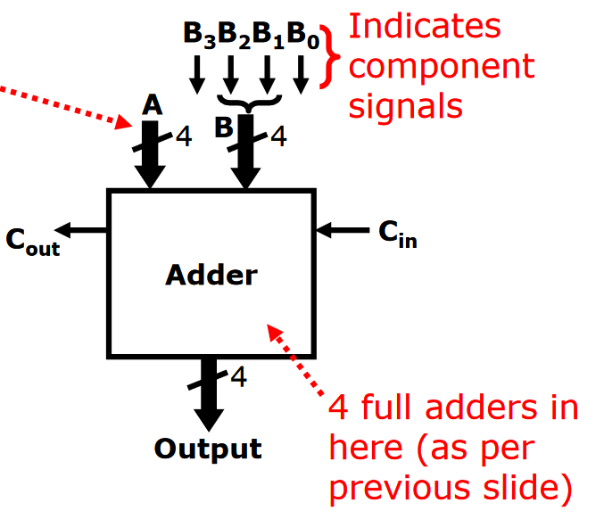
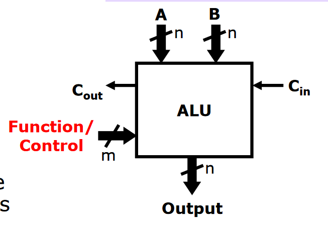
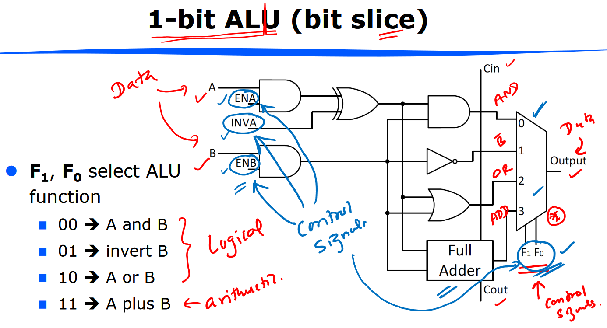
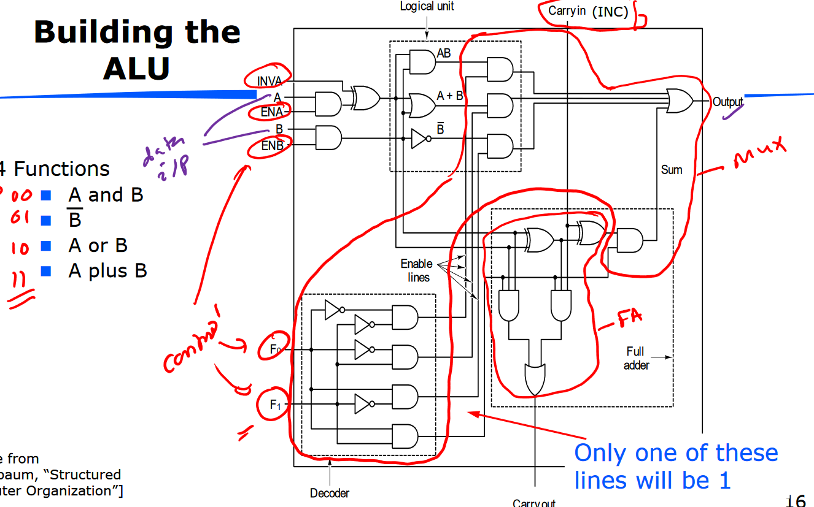
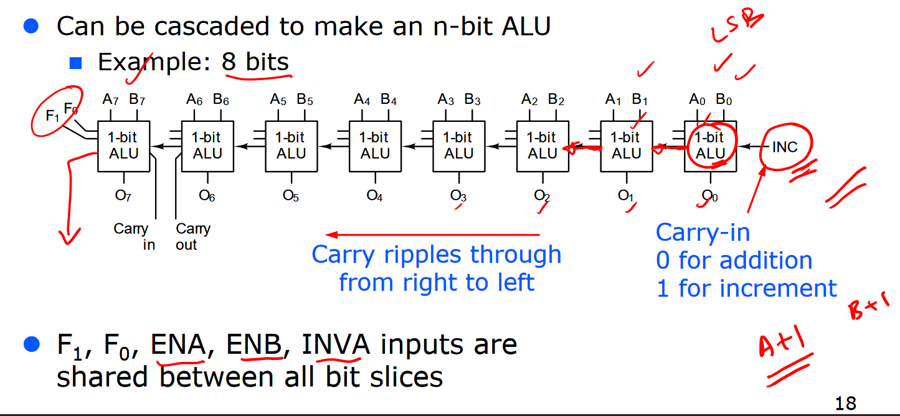
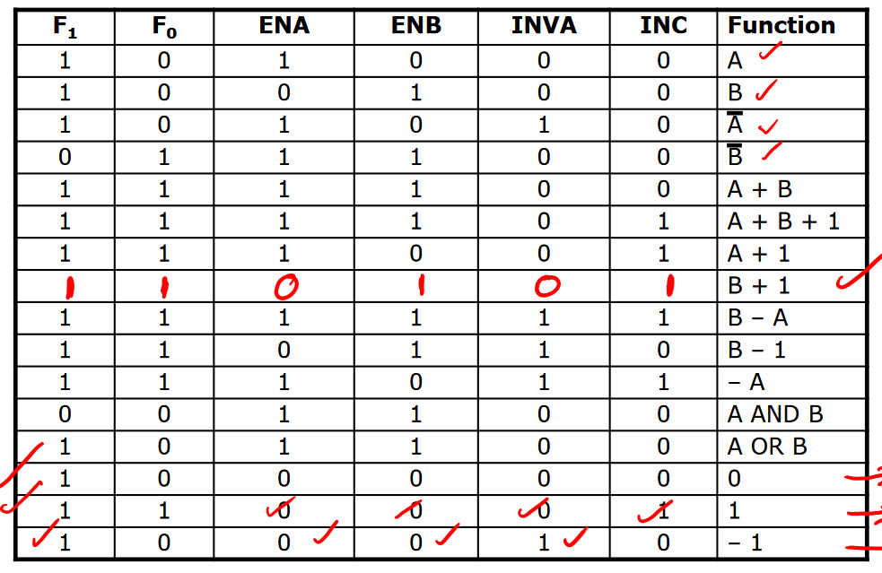
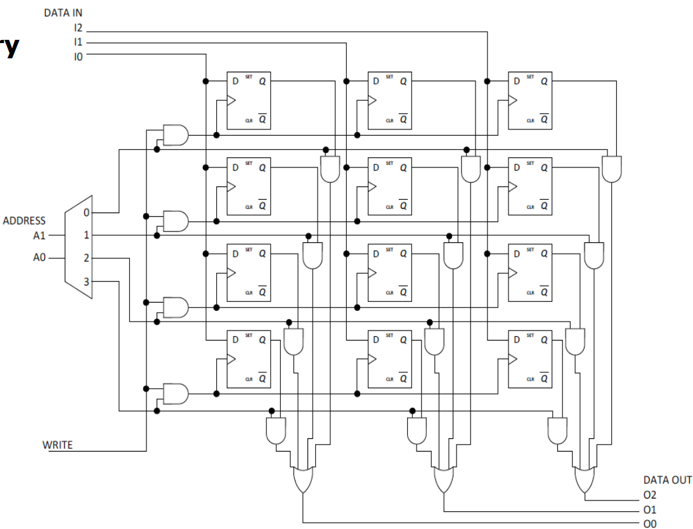

# Lecture 9

## Computer Organisation and Parts of a CPU

CPU contains:

- Control unit
  - Fetches instructions from memory and makes ALU, registers perform next instruction
- ALU (arithmetic logic unit)
  - Performs arithmetic and logical operations
- Registers
  - High-speed memory, used by the system. Can be 8-bit, 32-bit etc. This is *word size* of CPU.
  - Two types:
    1. General purpose register (or register file). Contains data to be operated on and temporary results.
    2. Special purpose register. Used by the system
       1. program counter (PC) - stores address of next instruction
       2. instruction register (IR) - stores address of current instruction
       3. Status register - see Lec10.

Registers are inside CPU, memory is outside CPU.

Buses are basically collections of wires that connect different parts of a computer. They can be internal (ALU to registers) or external (CPU to memory) to the CPU. Bus width is number of bits that can be transferred; may not be the same as CPU word size.

In reality, CPUs may have multiple processing units for integers and floating-point, and they may be able to operate in parallel.

## ALU

This is simplified diagram of a 4-bit ripple carry adder. Note that each incoming signal has slash 4, this indicates bit width of 4.

An ALU does more than adding - operations include

- Addition
- Increment (just add 1)
- Subtraction
- Bitwise AND
- Bitwise OR

You select the function of the ALU through the control inputs. Here is example for 1-bit:

INVA: inverts corresponding input if set to 1.
ENA / ENB: enables the corresponding input if set to 1. 

This is the above diagram in full - you can see the carry adder there, and the function inputs which actually select which result to output.

An n-bit ALU can be constructed by cascading n 1-bit ALUs. Here is an 8-bit example:

Using this, we can perform many different operations on A and B. For example, to calculate B - A,
$$
\begin{align*}
B - A &= B + (-A) \\
	&= B + (\bar A + 1) \\
	&= B + \bar A + 1.
\end{align*}
$$
This uses the properties of two's complement negation.

Here is a table of some useful combinations of ALU inputs:

## Data Path of ALU

CPU control unit determines which registers and control inputs to use.

Result then written to a register within register file (this could overwrite one of the operands)

Read/write from register <-> memory is also possible.

## Computer Memory

Lots of different types of memory - will cover in later lectures. Memory is used to store results, programs and remember settings when computer is powered off.

Memory composed of addressable cells, usually 8 bits wide (other widths have been used). Here is an example of how to construct a 4 x 3 memory (4 addresses, 3 bit wide cells)

Here, we use a decoder to select which cell to output, and our WRITE input is ANDed with the selected address and is connected to the clock input of each D-flip flop. When we have the rising edge of WRITE, the flip-flops in the cell corresponding to the selected address will clock.