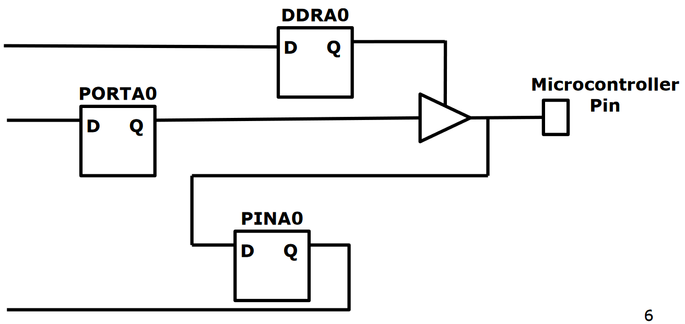

# Lab 11

read data in : pin as in p in

write data out : port as p out

DDR is data direction register. It is connected to a tri-state buffer (triangle thingy) as a control input, so when control is HIGH, PORT gets let through, when control is LOW, PORT gets blocked and PIN is valid.

**Need to set DDR before using pin**

Each of these registers are 8 bits wide, allowing you to configure each pin individually (for each port)

Always write DDR before you use it, instead of relying on default value.

COM 4

board needs to be powered, board powers microchip. connect 6 connector with cable up.