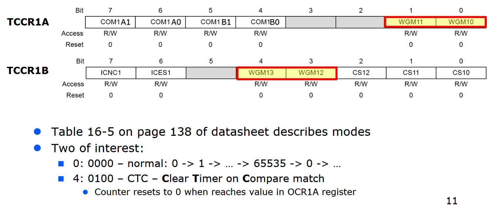
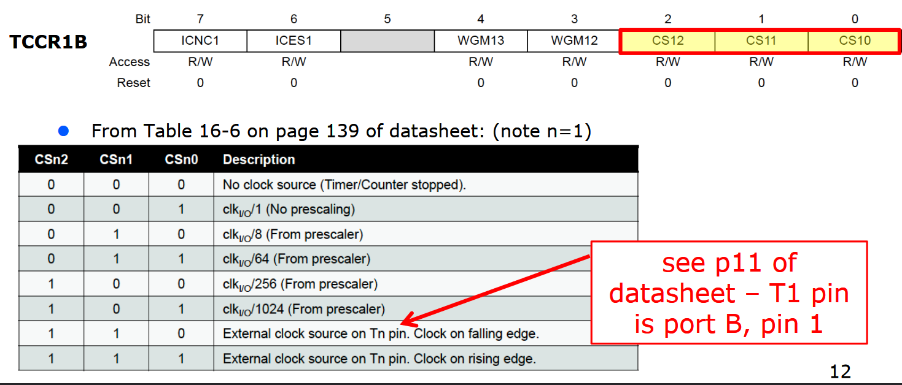
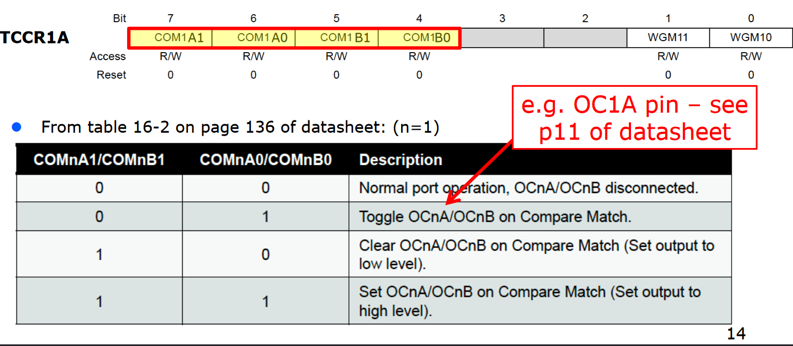

# Lab 13

To access 16-bit IO registers, use `high` and `low` to get the high and low bits of a constant.

```assembly
ldi r16, high(4321)
sts OCR1BH, r16
ldi r16, low(4321)
sts OCR1BL, r16
```

to set up timer/counter:

1. set up mode (wgm)
2. set up clock/prescaler (cs)
3. set up our output (com)

wgm: waveform generation mode.



CTC: clear timer on compare match. clears the timer when timer reaches value in OCR1A. Go from WGMn3, WGMn2, WGMn1, WGMn0.

Clock selection:



clk_I/O refers to the 8 MHz system clock. clock select talks about when we increment the counter, not what happens when it increments.

Output compare actions:



This i s what happens when we get the compare match.
$$
f_{osc} = \frac{f_{sys}}{\mathrm{PRE} * (\mathrm{OCR1A} + 1)}
\implies
\mathrm{OCR1A} = \frac{f_{sys}}{\mathrm{PRE} * f_{osc}} - 1,
$$
where $f_{osc}$ is desired oscillation frequency.

