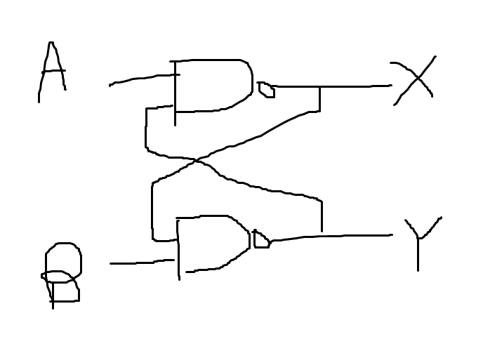

# Lab 5

## How does an SR latch work?

Truth table:

| Name                      | R    | S    | Q    | $\bar Q$ |
| ------------------------- | ---- | ---- | ---- | -------- |
| (outputs memorised value) | 0    | 0    | Q    | $\bar Q$ |
| Set                       | 0    | 1    | 1    | 0        |
| Reset                     | 1    | 0    | 0    | 1        |
| Invalid                   | 1    | 1    | 1    | 1        |

## Latch ccts

Want 

- set
- reset
- Q
- Q bar

if we just have some cross-coupled nand gates, don't know yet

truth table:

| A    | B    | X        | Y        |
| ---- | ---- | -------- | -------- |
| 0    | 0    | 1        | 1        |
| 0    | 1    | 1        | 0        |
| 1    | 0    | 0        | 1        |
| 1    | 1    | $\bar Y$ | $\bar X$ |

(A, B) = (1, 1) is the memory state. this is stable since $X = \bar Y = \overline{\overline X} = X$.

Here, we can call $X = Q$ and $Y = \bar Q$. Latch circuit just needs the 

- Set (Q = 1)
- Reset  (Q = 0)
- Memory

states. We have another state at (A, B) = (0, 0), which is an invalid state. Circuit will still be fine, but here the naming of Q and $\bar Q$ will be wrong.

The input which causes the set state is called S, and the input which causes the reset state is called R.

So, B = S and A = R.

### Latch requires

1. memory state
2. set state
3. reset state
4. 1 bit transition from memory <-> set, and memory <-> reset. this means that to go between these states, you only need to change 1 bit.
   1. this is because if you need to go through 2 bits, it's impossible to change both at once, so you will go through an intermediate state that you can't predict which one it is. this could be reset or memory or whatever.

