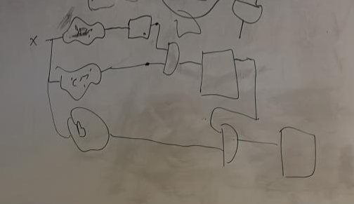

# Lab 6

Here is a way to implement a combination lock circuit using the fewest flip flops.

Here, assume we are checking for three numbers: A then C then B. Assume that the initial outputs of all flip-flops (drawn as squares) are low. Then, we have three combinational circuits which check whether our input signal X is equal to A, B, and C.

Instead of storing the entire n-bit input in n flip flops for each stage, we simply store the *result of the comparison* in one flip flop. If A is inputted, then the A flip flop will switch to high. If we then input C, then the result of the first and gate is high, so the C flip flop will switch to high.

Note that if we input A and then A again (or another wrong combination), the and gate will not return high, so the previous flip flops will just be set to low.