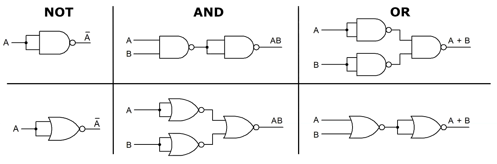
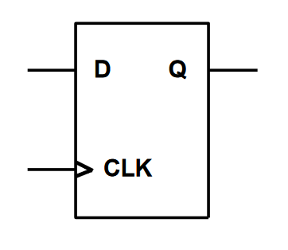
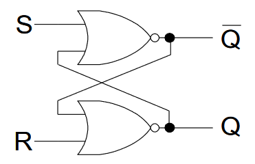
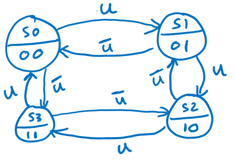

# Number Representations

## Integers

### Basic Conversion

Decimal to unsigned:

```
53 = 26  13  6   3   1   0
     1   0   1   0   1   1
Read right to left: 110101
```

Unsigned to decimal:

```
110101
= 1 + 4 + 16 + 32
= 53
```

### Comparison

| Representation   | Range                       | Description                        | Conversion                                         |
| ---------------- | --------------------------- | ---------------------------------- | -------------------------------------------------- |
| Unsigned         | $[0, 2^n - 1]$              | No negatives                       | As above                                           |
| Signed magnitude | $[-(2^{n-1}-1), 2^{n-1}-1]$ | Top bit is sign of everything      | Unsigned, indicate sign                            |
| 1's complement   | Same as signed mag.         | Top bit is $-(2^{n-1}-1)$          | From unsigned to negative, flip all bits           |
| 2's complement   | $[-2^{n-1}, 2^{n-1}-1]$     | Top bit is $-2^{n-1}$              | From unsigned to negative, flip all bits and add 1 |
| Excess-128       | Same as 2's comp.           | Number stored as true number + 128 | 2's complement but with sign bit flipped           |

Alternate method for unsigned -> negative 2's complement: start from LSB, copy all 0s and first 1, then flip all bits past the first 1.

### Arithmetic

Addition is just normal addition.
For subtraction, add the negative 2's complement of the number ($a - b = a + (-b)$).

### Overflow

Unsigned: MSB carry out is 1
2's comp: MSB carry in and MSB carry out are different

## Real Numbers

### Fixed-Point

Example: for 4-4 unsigned fixed-point notation (4 integer bits, 4 fractional bits), 4.375 is represented as `01000110`.

| 8    | 4    | 2    | 1    | d.p. | 1/2  | 1/4  | 1/8  | 1/16 |
| ---- | ---- | ---- | ---- | ---- | ---- | ---- | ---- | ---- |
| 0    | 1    | 0    | 0    | d.p. | 0    | 1    | 1    | 0    |

For 2's complement fixed-point, MSB is still $-2^{n-1}$, but remember that the rest is positive, so need to *add* the fractions, not subtract.

### IEEE Floating-Point

| Single Precision               | Double Precision                 |
| ------------------------------ | -------------------------------- |
| MSB is sign bit                | MSB is sign bit                  |
| 8 bits of exponent, excess-127 | 11 bits of exponent, excess-1023 |
| 23 bits of mantissa            | 52 bits of mantissa              |

| Case               | Exponent       | Mantissa |
| ------------------ | -------------- | -------- |
| Normalised         | Not all 0 or 1 | Anything |
| Denormalised       | All 0          | Not 0    |
| Zero               | All 0          | All 0    |
| Infinity (for x/0) | All 1          | All 0    |
| NaN (for 0/0)      | All 1          | Not 0    |

Example: single-precision representation of -23.25:

```
-23.25
= -(16 + 4 + 2 + 1 + 0.25)
= -( 1 0 1 1 1 . 0 1 )
= -( 1.0 1 1 1   0 1 * 2^4) (normalised)
4 + 127 = 131 = 1000 0011 (biased exponent)
So, representation is
1     1000 0111  0111 0100 0000 000
sign  exponent        mantissa
Or, 0xC1BA0000.
Note we don't encode leading 1 in mantissa.
```

# Boolean Algebra

## Useful Identities

- $AA = A$, $A + A = A$
- $0A = 0$, $A + 1 = 1$
- $(A+B)(A+C) = A + BC$
- $A(B+C) = AB + AC$
- $A(A+B) = A$
- $\overline{AB} = \bar A + \bar B$
- $\overline{A + B} = \bar A \bar B$
- $A\bar B + \bar A B = A \oplus B$
- $AB + \bar A \bar B = \overline{A \oplus B}$
- $\overline{A \oplus B} = \bar A \oplus B = A \oplus \bar B$

## NAND/NOR Equivalents



# Combinational Logic

## Adders

Half adder just adds two bits together with no cin; $S = A \oplus B$, $C_{out} = AB$.
Full adder adapts this for cin: $S = A \oplus B \oplus C_{in}$, $C_{out} = AB + C_{in}(A \oplus B)$ .

Cascade more full adders to make a ripple carry adder, where we chain previous cout to next cin.

## Other

Multiplexer: $2^n$ data inputs, 1 output, $n$ select inputs. It picks the data input based on decimal representation of select inputs. To implement arbitrary logic function, idea is to pick correct data inputs based on every combination of select inputs.

Decoder: converts $n$-bit select input to a logic high of $n$th output.

Demux/encoder: other way around.

# Sequential Logic

## D Flip-Flop



D input, Q output. On clock rising edge (or on falling edge if bubble), Q set to D. This allows one D flip-flop to remember 1 bit, so n-bit register requires n flip-flops.

### Shift Registers

- All flip-flops share CLK.
- Right shift: chain D on right to Q on left. 
- Left shift: chain Q on right to D on left.
- Serial can be sent in from first, and parallel out can be read from Q of each flip-flop.

## SR Latch

A 2-input circuit is a SR latch if it has:

1. memory state
2. set state
3. reset state
4. 1 bit transition from memory <-> set, and memory <-> reset

Following example has S = 1, R = 1 as invalid state:



## State Machines

### State Diagram

Set of arrows coming out from each state must be complete. Example is for 2-bit up counter:



### State Diagram to Circuit

1. Turn state diagram into 2D state table, which has current state (text), next state if each input (e.g. 0 or 1) and output for state.
2. Pick an encoding:
   - unsigned: just count up in binary
   - Gray: 1-bit transitions between each state (00 01 11 10)
   - 1-hot: one bit is high for each state
3. Make 1D state table, where you replace each state name with its encoding
4. Find boolean expressions for D1, D0, X from Q1, Q0, S (e.g.)
5. Draw logic diagram then circuit schematic

Similar process to construct counter circuits. For combination lock, the entire input state doesn't need to be stored every time; can make pure combinational circuit checking if value is expected, and then only store bool value if input matches.

# AVR 

## Inside CPU

CPU has 

