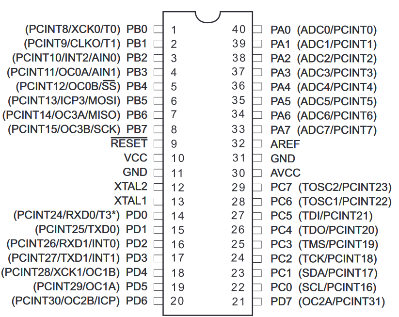
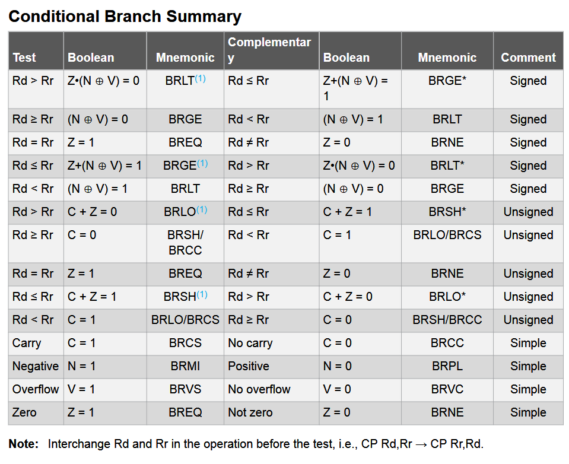
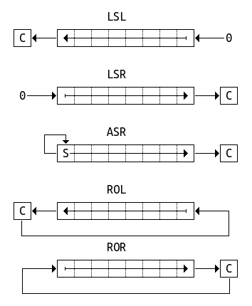
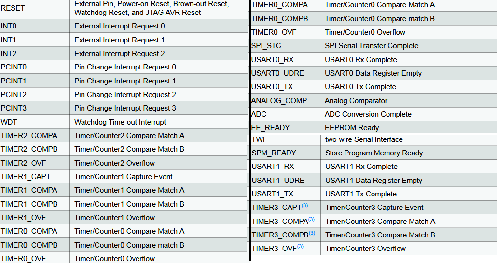
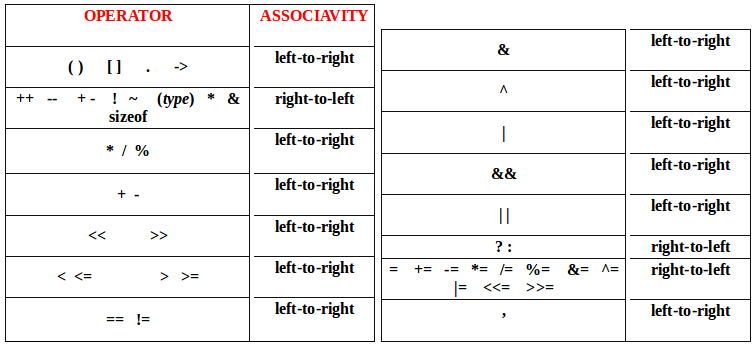
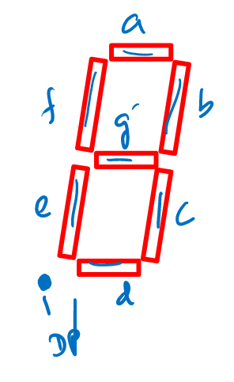
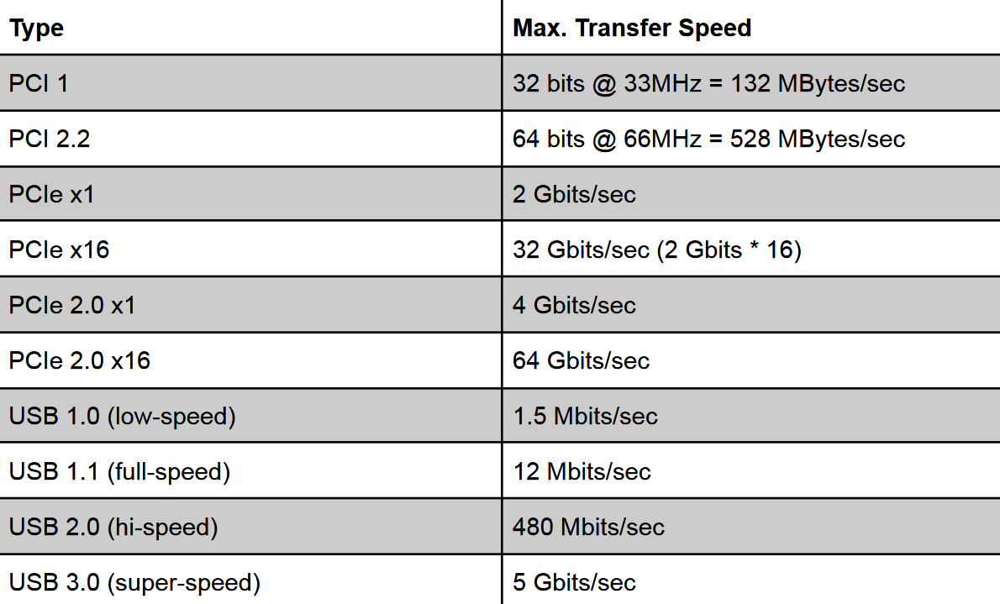

## Number Representations

Decimal to unsigned: split into powers of 2 then write from LSB upwards.
Unsigned to decimal: add powers of 2.

| Representation   | Range                       | Description                        | Conversion                                         |
| ---------------- | --------------------------- | ---------------------------------- | -------------------------------------------------- |
| Unsigned         | $[0, 2^n - 1]$              | No negatives                       | As above                                           |
| Signed magnitude | $[-(2^{n-1}-1), 2^{n-1}-1]$ | Top bit is sign of everything      | Unsigned, indicate sign                            |
| 1's complement   | Same as signed mag.         | Top bit is $-(2^{n-1}-1)$          | From unsigned to negative, flip all bits           |
| 2's complement   | $[-2^{n-1}, 2^{n-1}-1]$     | Top bit is $-2^{n-1}$              | From unsigned to negative, flip all bits and add 1 |
| Excess-128       | Same as 2's comp.           | Number stored as true number + 128 | 2's complement but with sign bit flipped           |

Alternate method for unsigned -> negative 2's complement: start from LSB, copy all 0s and first 1, then flip all bits past the first 1.
To subtract, add the negative 2's complement value.

### Fixed-Point

Example: for 4-4 unsigned fixed-point notation (4 integer bits, 4 fractional bits), 4.375 is represented as `01000110`.

| 8    | 4    | 2    | 1    | d.p. | 1/2  | 1/4  | 1/8  | 1/16 |
| ---- | ---- | ---- | ---- | ---- | ---- | ---- | ---- | ---- |
| 0    | 1    | 0    | 0    | d.p. | 0    | 1    | 1    | 0    |

For 2's complement fixed-point, MSB is still $-2^{n-1}$, but remember that the rest is positive, so need to *add* the fractions, not subtract.

### IEEE Floating-Point

| Single Precision               | Double Precision                 |
| ------------------------------ | -------------------------------- |
| MSB is sign bit                | MSB is sign bit                  |
| 8 bits of exponent, excess-127 | 11 bits of exponent, excess-1023 |
| 23 bits of mantissa            | 52 bits of mantissa              |

| Case               | Exponent       | Mantissa |
| ------------------ | -------------- | -------- |
| Normalised         | Not all 0 or 1 | Anything |
| Denormalised       | All 0          | Not 0    |
| Zero               | All 0          | All 0    |
| Infinity (for x/0) | All 1          | All 0    |
| NaN (for 0/0)      | All 1          | Not 0    |

Example: single-precision representation of -23.25:

```
-23.25
= -(16 + 4 + 2 + 1 + 0.25)
= -( 1 0 1 1 1 . 0 1 )
= -( 1.0 1 1 1   0 1 * 2^4) (normalised)
4 + 127 = 131 = 1000 0011 (biased exponent)
So, representation is
1     1000 0111  0111 0100 0000 000
sign  exponent        mantissa
Or, 0xC1BA0000.
Note we don't encode leading 1 in mantissa.
```

## Boolean Algebra

| $AA = A$, $A + A = A$                        | $0A = 0$, $A + 1 = 1$                                       |
| -------------------------------------------- | ----------------------------------------------------------- |
| $(A+B)(A+C) = A + BC$                        | $A(B+C) = AB + AC$                                          |
| $A(A+B) = A$                                 | $\overline{AB} = \bar A + \bar B$                           |
| $\overline{A + B} = \bar A \bar B$           | $A\bar B + \bar A B = A \oplus B$                           |
| $AB + \bar A \bar B = \overline{A \oplus B}$ | $\overline{A \oplus B} = \bar A \oplus B = A \oplus \bar B$ |


## Combinational Logic

*Half adder* just adds two bits together with no cin; $S = A \oplus B$, $C_{out} = AB$.
*Full adder* adapts this for cin: $S = A \oplus B \oplus C_{in}$, $C_{out} = AB + C_{in}(A \oplus B)$ .
Cascade more full adders to make a *ripple carry adder*, where we chain previous cout to next cin.

*Multiplexer*: $2^n$ data inputs, 1 output, $n$ select inputs. It picks the data input based on decimal representation of select inputs. To implement arbitrary logic function, idea is to pick correct data inputs based on every combination of select inputs.

*Decoder*: converts $n$-bit select input to a logic high of $n$th output.

*Demux*/*encoder*: other way around.

## Sequential Logic

### D Flip-Flop

D input, Q output. On clock rising edge (or on falling edge if bubble), Q set to D. This allows one D flip-flop to remember 1 bit, so n-bit register requires n flip-flops.

For shift registers,

- All flip-flops share CLK.
- Right shift: chain D on right to Q on left. 
- Left shift: chain Q on right to D on left.
- Serial can be sent in from first, and parallel out can be read from Q of each flip-flop.

### SR Latch

A 2-input circuit is a SR latch if it has:

1. memory state
2. set state
3. reset state
4. 1 bit transition from memory <-> set, and memory <-> reset

Example is cross-coupled NOR gates. $\bar Q$ on same side as $S$, $Q$ on same side as $R$. S=1 R=1 invalid.

### State Machines

Set of arrows coming out from each state must be complete.

1. Turn state diagram into 2D state table, which has current state (text), next state if each input (e.g. 0 or 1) and output for state.
2. Pick an encoding:
   - unsigned: just count up in binary
   - Gray: 1-bit transitions between each state (00 01 11 10)
   - 1-hot: one bit is high for each state
3. Make 1D state table, where you replace each state name with its encoding
4. Find boolean expressions for D1, D0, X from Q1, Q0, S (e.g.)
5. Draw logic diagram then circuit schematic

Similar process to construct counter circuits. For combination lock, the entire input state doesn't need to be stored every time; can make pure combinational circuit checking if value is expected, and then only store bool value if input matches.

## AVR CPU



*Control unit* fetches instructions from memory and makes ALU/registers perform next instruction. 

*ALU* constructed out of many ALU bit slices, where each supports many operations on 1 bit at a time: addition, inversion, OR, AND, etc. Chain carry out to next carry in, and function inputs go through all slices. Perform $B - A = B + \bar A + 1$ (add 1 to carry in).

To analyse ALU bit slice, follow circuit to see which values are enabled/inverted and which operation is being selected. Make sure to check for carry in.

| Position | Name | Description                                                  |
| -------- | ---- | ------------------------------------------------------------ |
| 0        | C    | carry-out                                                    |
| 1        | Z    | is zero                                                      |
| 2        | N    | is negative, basically just the MSB                          |
| 3        | V    | overflow (assuming 2's complement)                           |
| 4        | S    | actual sign of outputted value corrected for overflow, $S = N \oplus V$ |
| 5        | H    | half-carry bit: if there is carry out from first 4           |
| 6        | T    | test bit                                                     |
| 7        | I    | global interrupts enabled? (sei to set, cli to clear)        |

## C and AVR Assembly

GP: r0-r31, 8 bits wide. X is r27:r26, Y is r29:r28, Z is r31:r30. 64 I/O, 160 external I/O. Write DDR bit high for output and low for input; read from `PIN` and write to `PORT`.

### Assembly

`ld`/`st` for memory <-> register, `in`/`out` for I/O register <-> register.
`clr` clears, `ser` sets. `inc`/`dec` to increment/decrement.
`ldi rd, num` for r16-r31 puts number in `rd`. `mov rd, rr` does `rd = rr`.

`ld rd, Y` loads `rd` with value pointed to by `Y`
`ld rd, Y+` loads `rd` with value pointed to by `Y` and increments `Y` *afterward*
`ld rd, -Y` decrements `Y` *first* and then loads `rd` with value pointed to by `Y`
`ldd rd, Y+q` loads `rd` with value pointed to by `(Y+q)`. no incrementing; only for `Y` and `Z`.
above is very similar for `st Y, rr`, `st Y+, rr`, `st -Y, rr` and `std Y+q, rr`.
remember to `clr YH` or equivalent if you don't need it.

use `lds` and `sts` with the definitions in the include file when r/w to the extended io registers.
when using `ldi` to load 16-bit value, use `low(num)` and `high(num)` like `ldi r16, low(9999)`.

`push rd`: save value of `rd` onto stack
`pop rr`: pop top value of stack and save it to `rr`

`cpi rr, num` is very useful: compares value of register with literal `num`, for use with `brXX`





| Operation           | How                                                          |
| ------------------- | ------------------------------------------------------------ |
| 2's comp. negation  | 1. `com` all<br />2. add 1 to whole quantity                 |
| Addition            | 1. `add` least significant<br />2. `adc` the others going up |
| Division by 2       | If 2's complement, `asr` most significant<br />Else if unsigned, `lsr` most significant<br />Finally `ror` the others going down |
| Multiplication by 2 | `lsl` least significant then `rol` the others going up. <br />Doesn't matter if signed |



If needed, remember to `push r16`; `in r16, SREG`; `push r16` and then `pop r16`; `out SREG, r16`; `pop r16` at beginning and end of ISR. Return using `reti`. C ISRs require ISR macro in `#include <avr/interrupt.h>`.

To fully set up interrupts, need to write an ISR, `sei`, write 1 to specific flag in interrupt mask register, and write 1 to interrupt flag.

### Assembly Process and Linking

`call`, `jmp`, `lds` and `sts` are the only 32-bit instructions for AVR. The rest take up 1 cell.

- `.dseg`, `.cseg`, `.eseg`: changes to specified segment. Default is `.cseg`.
- `.byte n` reserves `n` bytes of space, must be in `.dseg`.
- `.db` and `.dw` define 1 byte / 1 word (16-bit) in `.cseg`/`.eseg`.
- `.def temp=r16` is alias for registers, `.equ sreg=0x3f` for constants, mutable. `.set` immutable.
- `.org num` sets location counter for current segment to `num`. 




## Timers/Counters

$$
\mathrm{OCR1A} = \frac{f_{sys}}{\mathrm{PRE} * f_{osc}} - 1
$$



Usually DP is MSB on left, then G through to A, where A is LSB.

For **PWM**:
freq to clock period with 1MHz clock: 1,000,000 / freq
duty cycle (%) to pulse width: dutycycle*clockperiod/100
then OCR1B = pulse_width - 1; OCR1A = clock_period - 1;

## USART

$$
\mathrm{UBRRn} = \frac{f_{osc}}{16 \cdot \mathrm{BAUD}} - 1
$$

where $\mathrm{BAUD}$ is baud rate e.g. 9600. Usually use asynchronous normal mode.

Frame is initially at logic 1, then start bit is 0, then write 5-9 data bits, then one parity bit, then 1 or 2 stop bits, then back to logic 1. Parity bit is set to either make total amount of high bits even or odd. Can detect if 1 bit has been flipped, but not 2 bits flipped or which one has been flipped.

## Data Storage and Transfer

$$
\begin{align*}
\text{avg access time} &= \frac{\text{e-e seek time}}{3} + \frac{\text{rot. time}}{2} \\
\text{rot. time} &= \frac{60}{\text{speed (rpm)}} \\
\text{total wasted space} &= \text{no. files on disk} \, \times \frac{\text{block size}}{2}
\end{align*}
$$



Latency: what's the time taken for one instruction to come out after it goes in pipeline?
Throughput: how often can you get one instruction in?

For $2^n$ cells, $\text{address width} = n - \left( \log_2 \text{data width} - \log_2 8 \right)$, where 8 is number of bits in byte. From data width = 8, every time you double data width, decrement address width.
