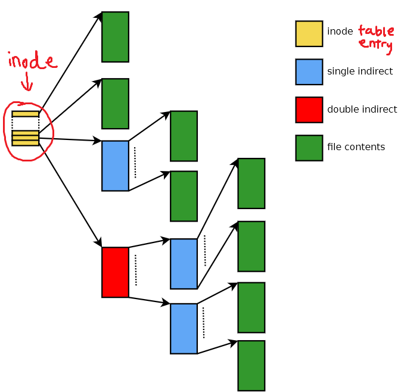

# Lecture 13

## File Systems
A *file* is some bytes stored in secondary storage -- we're not talking about some other uses of the file descriptor interface like sockets/pipes. A *disk* here refers to spinning magnetic storage. Most of this discussion is also relevant to SSD/flash storage, but we won't go into the differences (see COMP3301).
A *file system* is a data structure which manages
- contents of files (data)
- information about files (metadata)
- free space

The data structure also needs to exist somewhere, usually on a disk, but we can store file systems on other files (`.iso`,  `.dmg` for Mac).

Note that the operating system is independent of the file system -- Windows uses NTFS and Mac uses HFS+ by default, but they and Unix can understand different file systems. Also, one disk can have multiple file systems, used for hidden partitions on Windows, dual booting, and separating data from OS. Even one file system can be spread over multiple disks, used to increase capacity and to introduce redundancy (RAID).

Even the idea of a file having a 1-1 mapping to bytes stored on disk isn't necessarily true. One file can have multiple streams associated with it (see NTFS file streams), and some Linux systems support sparse files. To see this, on moss,
```c
FILE* f = fopen("bigfile.dat", "wb");
fprintf(f, "hello...\n");
fseek(f, 100L*1024L*1024L*1024L, SEEK_SET);
fprintf(f, "world!\n");
fclose(f);
```
This writes data 100GiB into a file. Running this program and `ls bigfile.dat` does indeed show that the file size is 100GiB, but `du -h bigfile.dat` (to get actual disk usage) shows only 74K. The file system is smart enough to know that there's 100GiB of nothing in the middle between the two strings. Clearly, files are more than their contents.
However, `hexdump -c bigfile.dat` isn't file-system aware, so it keeps going through, 16B at a time, until it reaches the end.

Also union file systems are interesting: the original file system is at the bottom, and another file system is overlayed on top, allowing them to be composed together. Docker uses this for efficiency.

### Metadata
Metadata is information *about* data which isn't a part of it. Some examples include:
- Name: does content change if name does?
    - Is name unique/case-sensitive?
- Location/path
- Size: `ls` vs `du`?
- Type of content
    - Inferred from name, like Windows?
    - Encode type with file, like old Mac?
    - Guess from contents, like `file`, which we can customise the behaviour of by changing `/etc/magic`
- Permissions
    - By role
        - Owner/group/other
        - `rwxr-x---`
    - Access control lists
        - Finer-grained per-user control that owner/group/other can't express
        - Windows and Unix have it as an option

Reminder for permissions: change permissions with `chmod`, with stuff like `u+r` (add read to owner), `g+x` (add exec to group), `o-w` (remove write from other).
`x` permissions are needed to execute, but to interpret (like a shell script), also need `r`. These are controlled by the kernel -- when executing something with `--x`, kernel executes in a way that we don't have access to the binary contents (so we can't run `gdb` on the assignment demo programs).

Directory permissions also exist -- `r` means we can read names of files in a directory, `w` means we can create new files, and to even interact with the files in that directory, the `x` bit must be set in all directories above it (`x` for traversal). If you have `x` without `r`, you can access things in the directory if you already know what they're called. Use `ls -ald dir` to get info about directories.

### Physical Storage
Spinning disks are slow as the radial coordinate needs to change and the angular coordinate needs to rotate to the desired position. We still need them for lower cost and large capacity (same with tape). If we try to extend the size of a file, the hard disk will need to store the next part in a separate location than the original. This is called *external fragmentation*. Also, if files are deleted, there is unused space inside allocated blocks, called *internal fragmentation*. 

Nowadays we use solid-state drives which have no moving parts, made of non-volatile flash memory. Wear levelling is a solution to minimise the effect of repeated reads/writes to the same location which would wear out parts of the disc.

### inodes
Storing the files linearly like a byte array is not a good idea, and a linked list structure would require traversing the entire length to get to the end of a file. Modern Unix file systems use index storage, similar to a multi-level page table. Each file has 1 inode associated with it, which is a table which stores metadata and some pointers. There are some *direct* pointers which point directly to blocks storing file content, and if those blocks are too small to store the file, there are some *single indirect* pointers which point to another table. If that isn't enough, use *double indirect*, etc.



Directories form a tree (no cycles). There are special functions used to access directories (not open/read/write/close). The directories contain a mapping from names to inodes (references to files), not files themselves.

Try `echo "hello" > a.c; ln a.c b.c`. Now, changing `a.c` will also change `b.c`, as `ln` has set up a *hard link* (`a.c` and `b.c` have the same inode numbers). As metadata is stored in inodes, `chmod u+x a.c` will also set `u+x` on `b.c`. The third field in `ls -li` is the *link count* -- files are reference counted, so when you `rm` a file it just `unlink()`s it and decrements. The underlying storage is freed whent the link count reaches 0. Hard links can also cross directories, but they cannot cross file systems.

Directories are inodes too, and their link count is at least 2 (one from `.` inside the directory, and one reference from the parent). So the link count = 2 + #subdirectories. Hardlinking directories is not allowed.

Symbolic or soft links are created with `ln -s original symlink`. inode numbers are different, and symlink's permissions are always `lrwxrwxrwx` but this is meaningless. They allow you to link across file systems, as they are just like leaving a note. Symlinks can dangle if the file it links to is deleted. Literally named references.

There are some uses for hard links, e.g. `/bin/gcc` and `/usr/bin/gcc` have same inode on moss, as `/bin` is a *sym*link to `/usr/bin`. 

### Mounting
To allow the OS to interact with other file systems they must be mounted. File systems should be unmounted before being physically removed as there still may be contents in buffer/background tasks occuring. `fflush` ensures buffers are flushed on file level, and `sync` command works on directory level.

On Windows, each drive is separate, like `A:\`, `C:\`, etc.
On Unix, all directories of all mounted file systems form one tree with `/` as root. File systems can be mounted in any directory, like permanent ones (`/home` on moss) or temporary `/media`.

### `ls` output
```
1446196 drwxr-xr-x 2 joel grp 4096 Jun 12 2018 bin
A       BC         D E    F   G    H           I
```
- A: inode number
- B: type
- C: permissions
- D: link count
- E: file owner
- F: file group
- G: size
- H: modification time
- I: name