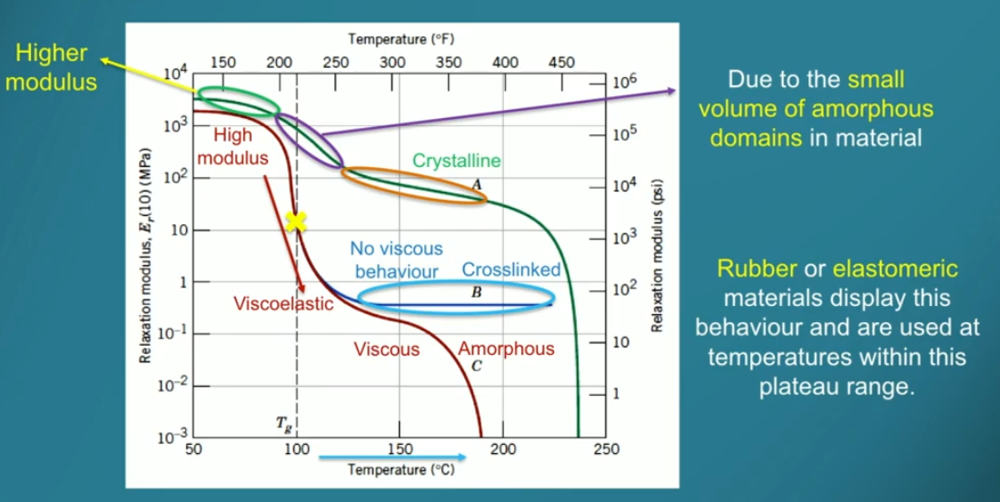

## Week 7

**Why are ceramics brittle?**\
Different atoms in the crystal structure with few slip planes so hard to get dislocations moving, and covalent/ionic bonding stronger than metallic bonding.

**What is responsible for plastic deformation?**\
Movement of dislocations.

**Diffusion requires what?**\
Need a defect for atom to move into, and sufficient energy to break bonds and distort lattice.

**What's the difference between vacancy and interstitial diffusion?**\
Vacancy diffusion is where a host/substitutional atom can move into a vacancy. Interstitial diffusion is where a small atom moves into interstitial space. This happens faster because smaller atoms are more mobile.

**When diffusing along grain boundaries/dislocations or through vacancies, which pathway is faster and why?**\
Grain boundary and dislocation diffusion are fast diffusion pathways because the atoms can be channelled along the sides. However, there's only 1 hole in a vacancy so only 1 can move.

## Week 8

**Why does austenite have a higher weight fraction of carbon compared to ferrite?**\
Austenite has a FCC crystal structure and ferrite has a BCC crystal structure. FCC has more space than BCC so carbon can fit interstitially more easily. 

**What happens when steel at eutectoid composition is cooled?**\
The steel first starts out as austenite. At the eutectoid temperature, the austenite starts transforming into ferrite and cementite within grain boundaries. As temperature decreases, the solubility of C in ferrite decreases, pushing C out of ferrite and thickening the cementite layers. This thickens cementite plates in pearlite and is diffusion-controlled (fast T drop means fine structure because less time for C to diffuse).

**Compare and contrast diffusive and displacive phase transformations.**\
Diffusive phase transformations are caused by diffusion, requiring T > 0.3Tm to 0.4Tm. Atoms diffuse from site to site, moving between 1 atom spacing and 0.1mm. This can change the composition of the phases present. Speed is strongly dependent on temperature (since it's diffusion-controlled), and the extent of the transformation is dependent on temperature and time.\
On the other hand, displacive phase transformations are caused by atoms breaking and forming atomic bonds, so atoms move very small distances in precise sequences. This is not diffusion-controlled so it can happen at any temperature, but the composition cannot change because there is no time for diffusion. Speed is very rapid, but extent is only temperature-dependent.

**Describe the microstructure of martensite and bainite.**\
Martensite's microstructure has needle-like grains where C atoms are trapped inside the matrix because there is no time for diffusion. Volume increases from austenite to martensite cause strains in the matrix, increasing hardness.\
Bainite's microstructure has fine cementite layers (similar to eutectic matrix formation) formed when C diffuses out of ferrite. 

**Why is the rate of transformation to pearlite faster at low temperatures?**\
At low temperatures, austenite (parent) is more thermodynamically unstable, which is the driving force for the transformation.

## Week 9

**Define ductility.**\
Ductility describes the amount of plastic deformation sustained at failure.

**Are FCC, BCC and HCP crystal structures typically ductile or brittle? Why?**\
Plastic deformation is a result of dislocation motion through slip planes - the densest planes of atoms within the unit cell. Since FCC and HCP are quite close-packed, the critical amount of shear stress to propagate dislocations is quite low compared to that of BCC (this is temperature-dependent though). HCP has a low amount (3) of slip systems, followed by FCC (12) and BCC (48). This combination of slip system number and critical shear stress typically makes HCP brittle and FCC ductile; BCC's ductility depends on temperature.

**Explain the process of work-hardening.**\
There are compressive and tensile strains surrounding edges of dislocations. Dislocations close to each other impede the motion of other dislocations, so by deliberately introducing plastic deformation we increase dislocation density which results in an increased stress required for further deformation.

**What are some disadvantages to work-hardening?**\
If we keep work-hardening the material, we make it very strong but brittle; further deformation during service would cause fracture. Elongated grains from rolling introduce anisotropic properties: stress *parallel* to rolling direction results in high strength and low ductility, but stress *perpendicular* to rolling direction results in low strength and high ductility. The material can fail well below the estimated limit if it is loaded in the wrong direction.

**Why do grain boundaries act as a barrier to dislocations?**\
Crystals at grain boundaries change orientation, and slip planes are discontinuous at grain boundaries.

**Explain the process of annealing.**\
We want to reduce the brittleness and anisotropy of heavily cold-worked materials. Note that strain energy in lattice $\Delta E \approx \rho G b^2$, where $\rho$ is dislocation density, $G$ is shear modulus and $b$ is the Burgers vector. Reducing dislocation density reduces lattice strain, which is the purpose of the recovery phase. At elevated temperatures, dislocations of opposite direction move and cancel each other out, reducing the total strain energy. \
After recovery, we leave the material at the recrystallisation temperature (0.3-0.5Tm) for some time, which forms new *strain-free* equiaxed (width = height) grains starting off as small nuclei, like the solidification process. This happens because of the difference in energy between strained and unstrained regions of the lattice. Note that since the difference in energy drives the process, we need a minimum cold work percentage to enable recrystallisation, usually around 10%.\
Grain boundaries have higher energy than the inside of the grains, so by leaving the material at elevated temperatures, atoms diffuse over the boundaries increasing grain size. This decreases the total energy (thermodynamically favourable).

**What do we require of a material for it to be precipitation hardened?**\
We need a high solubility of 1 phase in another, and a rapidly decreasing solubility limit while reducing temperature.

**How do precipitates form when precipitation hardening?**\
We first heat the metal up so that only one phase is present - let's call it alpha and the other phase theta. This is called *solution treatment*.\
Cooling the material slowly at this stage leads to theta precipitates forming at grain boundaries due to the higher energy. However, we now *quench* the metal forming a supersaturated solid solution, where the secondary atoms are now trapped within the alpha grains. This is where we want them to be, instead of at the boundaries.\
Now, we just need to allow a bit of diffusion by increasing temperature, enough to fully form the precipitates within the grains, but not enough for the secondary atoms to diffuse to the grain boundaries. This is called *aging*. We shouldn't increase T high enough that we're in the single phase region of the phase diagram; this is back to where we started.

**What does it mean for a material to be overaged in the context of precipitation hardening, and why is it bad?**\
The aging process starts off with a supersaturated solid solution. Using Al and Cu as an example where Cu is the secondary atom, Cu gathers in small discs in the solution called GP zones. Then, as temperature is raised to start aging, Cu starts to diffuse forming distinct particles. It first passes through the theta'' phase which is coherent with the matrix (lattice bonds pass through the zone, no disruptions), then intermediary theta' phase, then just normal theta which is incoherent. Particle size increases with time.\
Yield stress increases between the development of GP zones and theta'' because of coherency stress associated with the strain created while the particles are growing coherently.\
If the precipitates are small (theta''), dislocations just cut through. New surface area on the cut gives more energy, so this increases the yield stress. However, if the precipitates become too big, dislocations loop around them and simply bypass. This is called bowing and reduces the yield stress in comparison to theta''. Also, there is now more space between precipitates so not as many particles interfere with dislocation motion.\
Because of this, we only want to age the material up to the optimal point where theta'' precipitates are created. Letting theta' and theta precipitates form is called overaging which decreases the yield stress. Note that overaging can occur during service if the alloy is already at the optimal aging level and experiences elevated temperatures. Thus, for welded structures, don't pick an alloy which is already at the optimal level, as welding will age the metal further.

**What is the difference between precipitation hardening and solid solution strengthening?**\
Both inhibit dislocation motion, but precipitation hardening is when you use a *supersaturated* solid solution to trap the secondary atom and form precipitates, whereas solid solution strengthening is when everything remains in the single phase region and you use substitutional/interstitial defects to add strain into the lattice.

## Week 10

**Explain how typical Young's Modulus values change between linear, branched, crosslinked and networked polymers.**\
Linear polymers have covalent bonds within chains, but have weak Van der Waals and hydrogen bonds between chains. This leads to a low Young's modulus and yield strength as the intermolecular bonds are weak. Branched polymers have side chains - more contact with other molecules, would have slightly higher Young's modulus. Crosslinked polymers have covalent bonds connecting adjacent chains, giving a higher E than linear polymers. Network polymers have more than 3 covalent bonds between chains, forming a 3D network. This would, yet again, have a higher Young's modulus.

**What's the difference between thermoplastics and thermosets?**\
Thermoplastics are usually linear polymers and soften when heated, which are either amorphous (random chain arrangement) or semi-crystalline. Thermosets are cross-linked polymers with higher E, and just decompose when heated to sufficient temperatures. The stability from the crosslinking makes them chemical and creep resistant.

**What happens at the glass transition temperature?**\
Tg is the temperature at which chains contract too much to flow smoothly past each other. Above Tg, E and strength decrease but ductility increases (more energy for them to flow), and below Tg polymer becomes brittle.

**Why are brittle materials with low K1c vulnerable to catastrophic brittle failure?**\
For tough and ductile materials, crack initiation is difficult as strength is high and crack propagation is difficult due to ductility. Plastic deformation occurs at the crack tip which reduces stress concentration. However, in brittle materials, such plastic deformation is not possible, so crack propagation is very easy. This leads to catastrophic failure if a crack is made.

**What is leak-before-failure for pressure vessel design?**\
Make the wall of the pressure vessel less than the critical crack length for the material and load. So the crack will penetrate through the wall causing the contents to leak before the entire vessel catastrophically fails.

**What properties are we looking for in the matrix and fibre in a fibre-reinforced composite?**\
Matrix materials should be ductile and have E less than the fibre. Fibres add stiffness, strength and improve the toughness of the composite. 

**Is having a slightly weak interface necessarily a problem for fibre-reinforced composites?**\
Although a strong interface between matrix and fibre improves overall stiffness, a slightly weaker interface will improve the overall toughness (there's more 'give' so area under stress-strain curve will be larger).

**What effect does fibre length have on a FRC's strength?**\
The stress transmitted through the interface between matrix and fibre is dependent on the interfacial bond strength, or alternatively, the shear yield strength of the matrix. If the length of the fibres are equal to the critical length, maximum fibre load is only achieved at the centre of the fibre. We should make this longer so the stress is transferred over a larger length of fibre (fibres should be much better at withstanding this tensile stress than the matrix). However, if the fibres are really small, the matrix will be doing most of the work as there aren't opportunities for the fibre to take on maximum load. This reduces the strength of the composite.\
Note: for a fibre to be considered continuous, it must have at least **15x** the critical length. Can calculate critical length with $l_c = \frac{\sigma_f d}{2 \tau_c}$, where $\sigma_f$ is tensile strength of fibre, $d$ is fibre diameter and $\tau_c$ is matrix shear strength.

**Are there any advantages to having fibre length less than the critical length?**\
Actually yes; although the matrix will be taking most of the load, fibres get pulled out of the matrix when cracks propagate. This increases energy required to propagate and thus increases fracture toughness.

**What does a stress-strain curve of a typical FRC look like?**\
Consider a brittle ceramic fibre and a ductile polymer matrix. The curve has a linear region until the matrix *yields*, at which the fibres carry extra load until they fracture (decreased E for this region). As the fibres break, stress drops to the stress carried by the matrix and is sustained by the matrix until failure.

**Describe the relationship between FRC strength, fibre volume fraction and the fibre orientation to applied load.**\
In the stress-strain curve described above, we want the fibres to fracture after the matrix yields to increase the strength as much as possible. There is a critical volume fraction where if volume fraction is increased below Vfcrit, fibres will actually fracture sooner before the matrix yields so strength will be very low. Above Vfcrit, the matrix will yield first as intended so increasing Vf will then increase strength. Ideally this is piecewise linear but I'm not sure if that's true in practice.\
The failure mode of a composite depends on the orientation of the fibre to the applied stress.

- Stress parallel to fibre: failure governed by T strength of fibre, relatively *high*
- Angle increases from parallel to perpendicular: failure governed by shear strength of matrix, relatively *low*
- Stress perpendicular to fibre: failure governed by T strength of matrix, not as high as T strength of fibre.

Worst option is to orient at around 45°.

## Week 11

**What is the difference between primary, secondary and tertiary creep?**\
Primary creep is characterised by an initial instantaneous strain (from stress-strain curve), with a decreasing creep rate from strain hardening. Secondary creep has a constant, steady-state creep rate due to the competing processes of strain hardening and recovery (this is at elevated temperature). Tertiary creep has an increasing creep rate and is the last stage before rupture. This could be due to material imperfections which cause stress concentrations, or where the material necks so stress increases.

**Compare dislocation creep and diffusion creep.**\
Dislocation creep occurs at high stresses and involves movement of dislocations past precipitates. At normal temperatures, precipitates act as a barrier to dislocation movement (which is the purpose of precipitation hardening). However, at high temperatures, atoms can actually diffuse perpendicular to the direction of the precipitate so that the dislocation moves out of the way and continues unobstructed. This vertical movement is called dislocation *climb*, and the horizontal movement through precipitates is called dislocation *glide*. Both combined cause dislocation creep.\
Diffusion creep can be categorised as either bulk diffusion creep or grain boundary diffusion creep, but both elongate grains and cause a strain parallel to stress direction. Grain boundary diffusion creep is when atoms in grain boundary diffuse and occurs at lower temperatures compared to bulk diffusion creep (because of the internal energy), where atoms diffuse from grain interior towards stress direction.

**What can we do to reduce the effect of creep?**\
Use a material with a higher melting temperature as the threshold for creep to start is dependent on Tm. Introduce more precipitates by precipitation hardening so even if dislocations climb, there's still a lot to get through. Use a material that has a large grain size or is made out of a single crystal to nearly eliminate grain boundaries so diffusion creep can be reduced.

**What is the mechanism behind fatigue?**\
We start off with crack initiation, which is basically just when you push in and then pull out on the material, and it forms a microscopic crack on the boundary. Recall that we must have a fluctuating load for fatigue.\
Then, we have crack propagation, which is where the crack propagates perpendicularly to the applied stress due to alternating tension (crack opens) and compression (crack closes, surface area pushes through and increases length).\
Lastly, we have final failure, where the material fails rapidly once a critical crack length is reached. This is typically brittle failure and is rapid.

**What changes can we see under a microscope during fatigue?**\
Can't see much for crack initiation as cracks can be just several atoms thick. Cracks propagating leaves back striations or beachmarks on the material, which look like parallel lines indicating a crack has passed through. We're looking for rapid failure areas to indicate the final failure stage.

**From a material standpoint, how can we avoid fatigue in components?**\
Material properties are important such as fracture toughness, but we need to ensure the surface is smooth and doesn't have any stress concentration areas (no sharp edges). Shot peening and case hardening are processes which can help with this.

**What is the strain response of pure elastic, viscous and viscoelastic polymers to a constant load?**\
Pure elastic polymers have constant strain at constant load, and have instantaneous increase and decrease in strain when load is applied/removed. Purely viscous polymers gradually increase strain while the load is applied and do not recover strain afterwards.\
Most polymers are viscoelastic, displaying an initial instantaneous and then gradual increase when load is applied, an instantaneous partial recovery then a gradual decrease when load is removed. Not all strain is recovered. 

**Describe the differences in the relationship between relaxation modulus and temperature for amorphous, lightly cross-linked and crystalline polystyrene.**\
this is a lot to explain aaa, i'll just put the image here

**How is the mechanism for creep different in polymers compared to metals?**\
Creep in polymers is caused by molecules slipping past each other, not by vacancies or diffusion as in metals or ceramics. Also, the temperature relative to Tg is important (see previous image).

## Week 13

**What are three necessary conditions for corrosion?**\
We need a material being corroded, an environment doing the corrosion, and an interface between the material and the environment. 

**What properties of a metal and its oxide contribute to forming a coherent oxide film?**\

1. We want a P-B ratio between 1 and 2, indicating that compressive stress will develop in the film as it forms, but the film won't be porous or unprotective.
2. The oxide should stick to the metal.
3. Both oxide and metal should have similar thermal expansion coefficient, because if the metal's is higher then it will push against the oxide and encourage it to flake off.
4. Since oxide layer growth is controlled by the diffusivity of the ions in oxide, having a high melting point and good plasticity at high temperatures (for the oxide) will decrease diffusion rates.

To prevent dry oxidation, we can apply our own protective coating like paint (removing interface) or add alloying elements to achieve better P-B ratio.

**How can we use the EMF series to predict whether a corrosion reaction will be spontaneous or not?**\
Recall that for a metal to dissolve, the driving force is Gibbs free energy $\Delta G = -EnF$ with $E$ as voltage. If $E > 0$ then $\Delta G < 0$ so spontaneous; if $E < 0$ then $\Delta G > 0$ so non-spontaneous.\
To find E from EMF series, $E = E_{cathode} - E_{anode}$. The metal is most likely the anode as it's the one being oxidised (oxidation is loss, OIL).

**How can we design against galvanic corrosion?**\

- Avoid dissimilar metals
- Electrically insulate the different metals
- Make the critical component the *cathode*
  - If critical component has to be anode, make surface area larger. Not sure what this does tbh
- Use a sacrificial anode: connect a 3rd material which acts as anode to both, so critical anode is now cathode.
- Galvanise: coat Fe with Zn to form a barrier as Zn more reactive than Fe
- Impressed current: supply electrons from some external voltage source to encourage component to be a cathode (it's gaining electrons so it doesn't oxidise).

